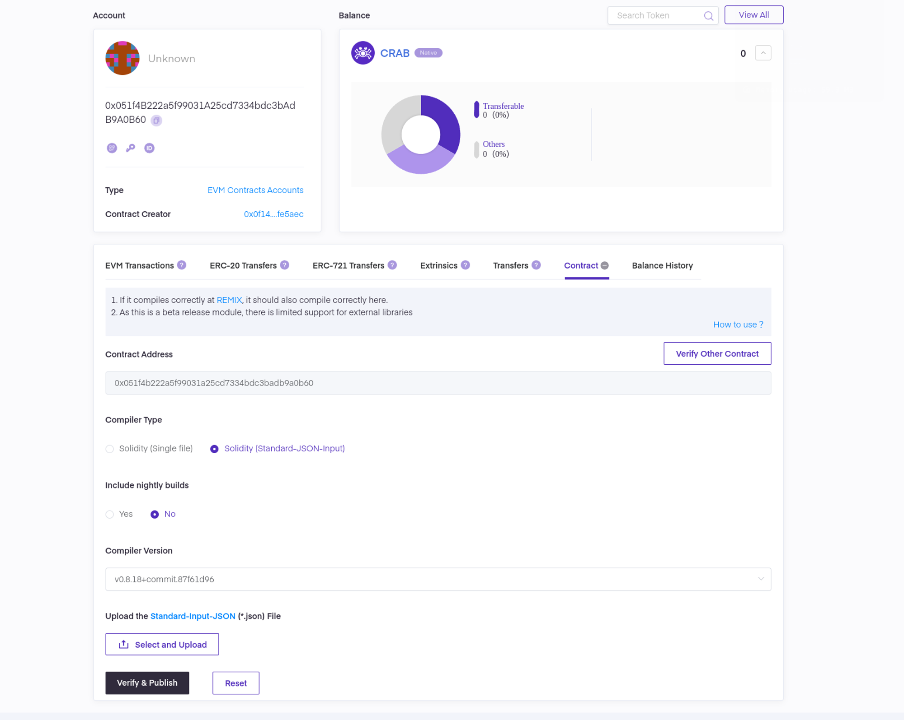

# Verify Smart Contract

Verifying smart/token contracts is a crucial step in development, as it allows developers to ensure the contracts' correctness and security. Once verified, the contract's source code is made public, enabling independent verification, which fosters trust and transparency. This reassures users that the contracts operate as intended without any malicious code. It also simplifies the process for other developers to engage with your smart contracts.

For Darwinia chains, Subscan is the most commonly used explorer, offering contract verification services for both the Darwinia and Crab networks. This tutorial will guide you through the contract verification steps

## Verify Contracts

1. Navigate to the appropriate [Subscan](../../learn/chains/crab.md#network-info) explorer, using the Crab chain as an example. Once there, open the contract page as demonstrated in the screenshot below.
    
    
    
2. Verify the contract by submitting the concrete contract information or [standard input JSON](https://github.com/subscan-explorer/sourcify/blob/feat/doc/docs/Standard-Input-JSON.md), similar to the process used on Etherscan, then click `Verify & Publish`.