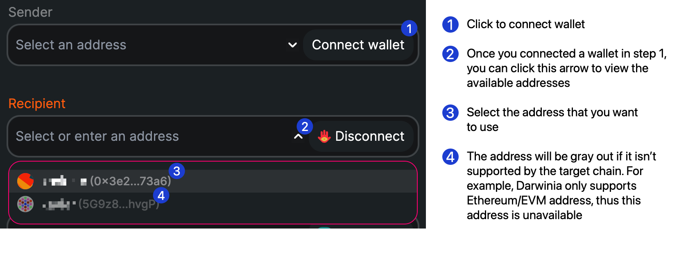
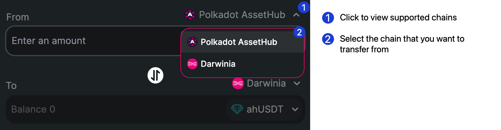
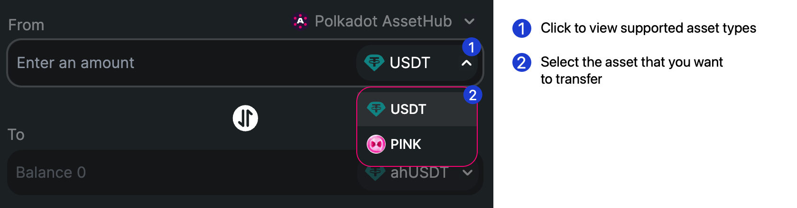
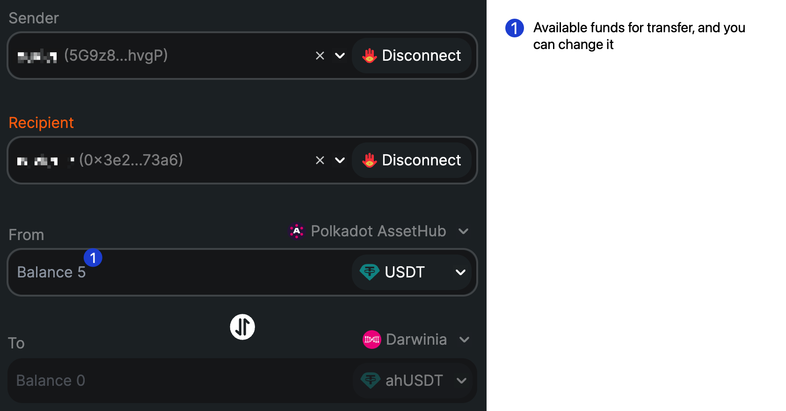

# AssetHub Bridge Tutorial

This tutorial provides a basic guide on using [assethub-bridge.darwinia.network](https://assethub-bridge.darwinia.network) to perform a XCM cross-chain transfer between Darwinia and AssetHub.

!!! note
    Please note that this bridge requires USDT for transaction fees on both ends, so ensure you have some USDT in your wallet before using it. On the AssetHub side, you can purchase USDT through a centralized exchange (CEX) like Binance or a decentralized exchange (DEX) such as Moonbeam Swap. On the Darwinia side, you'll need to first transfer some USDT from AssetHub to Darwinia using this bridge; then, you can proceed with transfers from Darwinia to AssetHub.

### Connect Wallets

You will need to connect two types of wallets: **Sender** and **Recipient**. The **Sender** address should be in the SS58 format for AssetHub, and the **From** address should be in the Ethereum/EVM format for Darwinia when transferring funds from AssetHub to Darwinia, and vice versa.

### Select the Chains and Asset

Choose the appropriate blockchain and asset for the transfer. The images below illustrate how to select these options.

### Fill-in Amount

After entering all the required information, the interface will automatically display the available balance for the selected asset on the **From** chain. Enter an amount that is equal to or less than this available balance.

### Send

To complete the transfer, simply click the **Send** button to sign and send the transaction.
