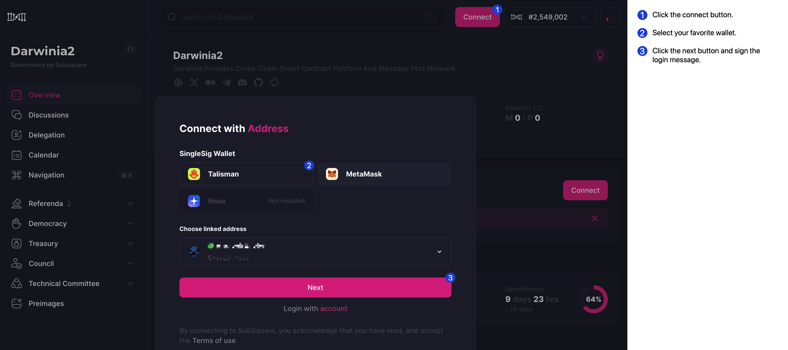

# Governance Tutorial

In this tutorial, we'll guide you through using the [Subsquare](https://darwinia2.subsquare.io/) platform for governance activities. Ensure you have either Metamask or Talisman wallet installed before you begin.

### Sign-in

To start, sign in using your wallet. Here's how the sign-in page looks:

### Propose a Referendum

Navigate to the referendum proposal section as shown below:

### Fill the Proposal Preimage

Fill in the necessary details for your proposal. Refer to the screenshot for guidance on completing this step:

### Submit the Proposal

Once you've filled in all the required details, submit your proposal. Below is a snapshot of the submission interface:

## Elaborate on the Proposal Details to the Community

After submitting your proposal, it's important to communicate and elaborate on the details to the community. This helps in building consensus and encouraging discussions. Below are images depicting how you can present your proposal details:

