# Multisig Wallet

!!! note
    The information provided here is for informational purposes only and is sourced from the Darwinia Community DAO. Darwinia does not endorse this project. Please conduct a thorough audit before using it at your own risk.

[Multisig wallets](https://www.coindesk.com/learn/what-is-a-multisig-wallet/) have emerged as a trusted solution, offering an additional layer of security against unauthorized access and potential loss. One such multisig wallet is the [DSafe Wallet](https://multisig.darwiniacommunitydao.xyz/), developed by the [Darwinia Community DAO](https://app.dework.xyz/darwinia-dao). DSafe Wallet is a fork of the renowned Gnosis Safe Wallet, created by Gnosis. This wallet requires a minimum number of people to confirm transactions before they can be executed, following the M-of-N model. Using DSafe Wallets is similar to using the Gnosis Safe Wallet, with the main difference being that DSafe Wallet operates on the Darwinia Chain. Now, let's dive into the process of using DSafe Wallet and explore its functionalities

## Create Multisig Wallet

1. Open [DSafe Wallet](https://multisig.darwiniacommunitydao.xyz/)
2. Switch your MetaMask to the Darwinia Chain
    
    DSafe Wallet consists of multiple owners. To create a multi-signature wallet, you first need to connect your regular wallet using MetaMask (or any other compatible wallet). If you haven't added the Darwinia Chain before, you can add it by visiting this [link](../chains/darwinia.md).
    
3. Click "Create new Account" to initiate the process.
    
    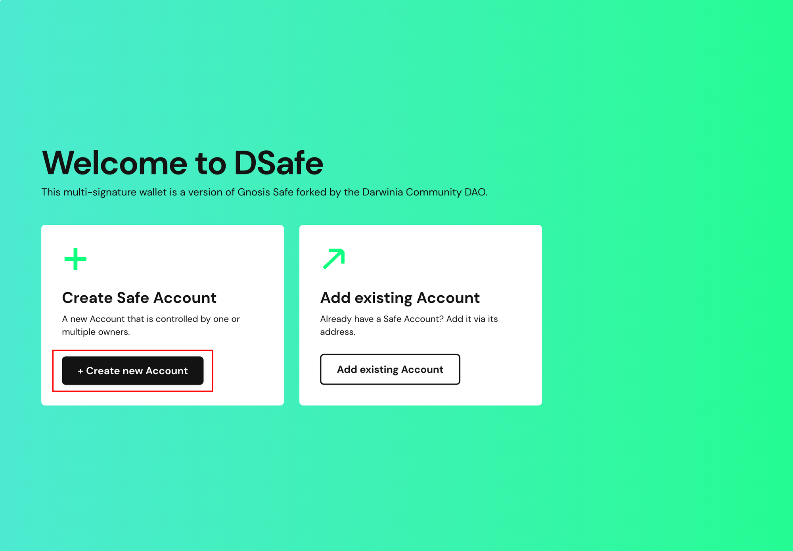
    
4. Enter the wallet name here, and then click "Next”.
    
    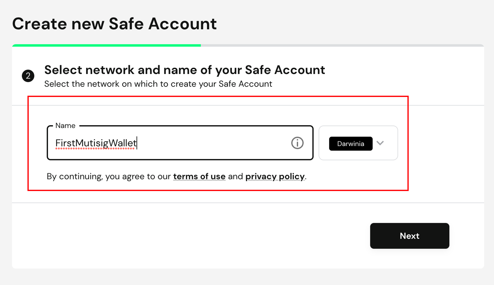
    
5. Select the signers(owners).
    
    This step is crucial because these addresses have the authority to submit and approve transactions. The connected signer wallet has been suggested as the first signer. You can add any number of signers by pasting Ethereum addresses or entering ENS names.
    
    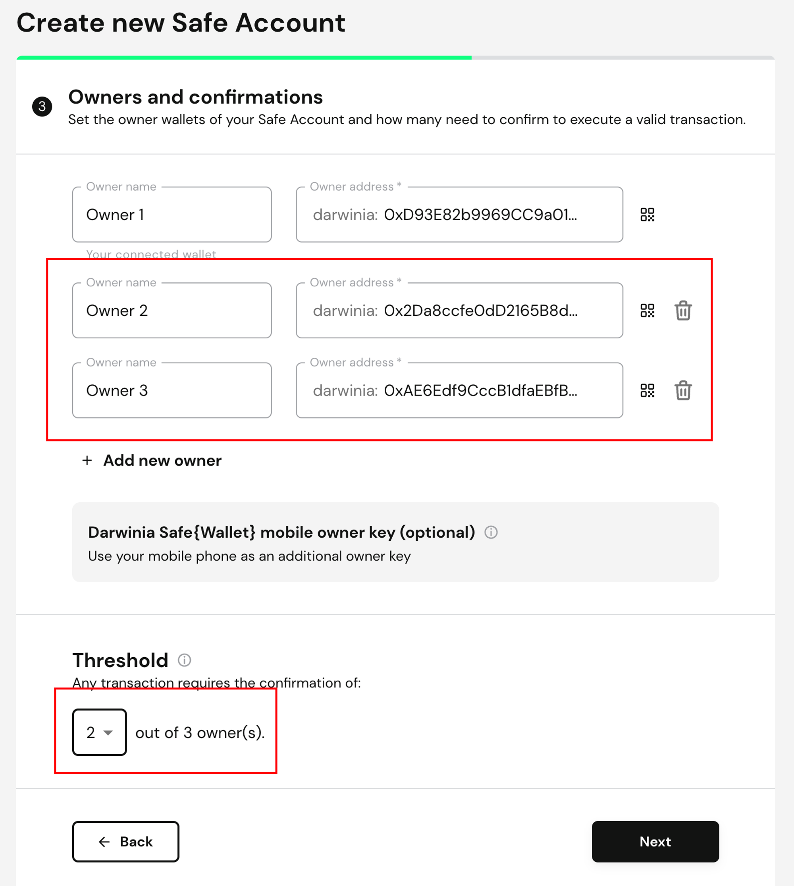
    
6. Select threshold.
    
    Be cautious when setting the threshold as shown in the figure above. In this example, a 2/3 multi-signature wallet will be created, meaning that assets in the wallet can only be accessed when two out of the three addresses confirm(approve) the transaction.
    
    - Any transaction or changes to the settings of this multi-signature account require confirmation from the specified number of signers. Carefully consider your settings. If you do not have access to enough signers to reach the threshold, you will be unable to retrieve your assets.
    - You can create configurations such as 3/5, 7/10, etc. The higher the threshold, the more secure it is.
    
    !!! note
        A **personal wallets** suggestion, you can set up 3 owners (1 MetaMask and 2 hardware wallets) with a threshold of 2. The MetaMask and one hardware wallet can be used daily to sign and execute transactions, while the second hardware wallet is securely stored in case one of the other two owners is lost.
    
    !!! note
        A suggestion for **wallets managed by a group** , a common setup is for each individual to have 1 owner account, with a threshold of 3. Therefore, one person alone cannot execute a transaction, and all transactions require approval(confirmation) from the other 2 individuals.
    
7. Review
    
    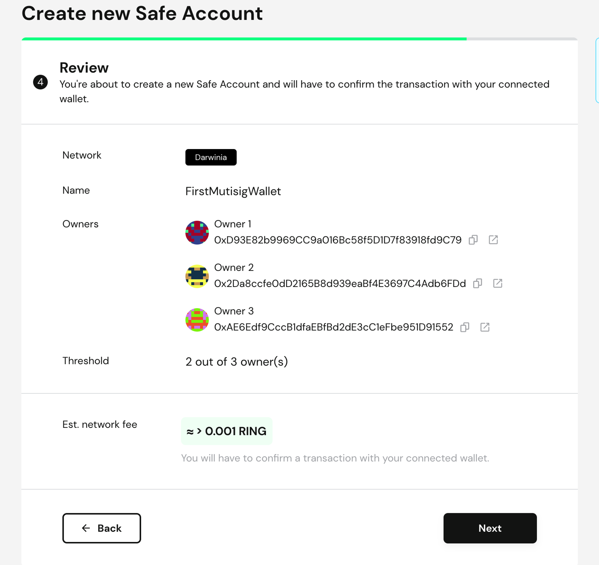
    
8. Finally, the MetaMask transaction confirmation window will pop up. Click "Confirm". After a small amount of RING is spent, wait for the transaction to be executed successfully. Once completed, a DSafe multisig wallet will be created. Please note that during this process, do not navigate away from the current page until the transaction is completed.
    
    
    

## Token Transfer

1. Click "New transaction" to initiate a transfer transaction.
    
    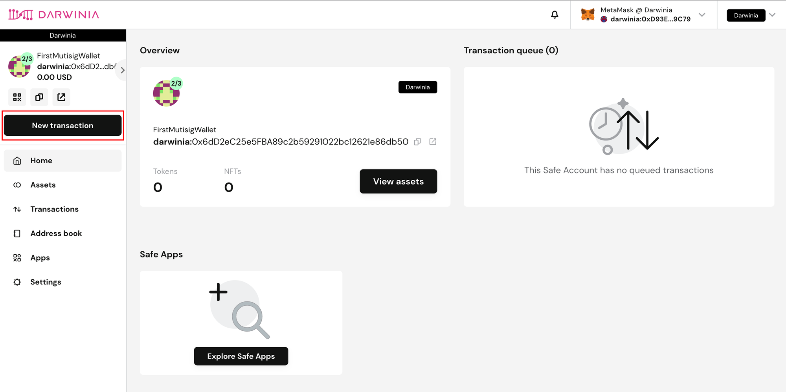
    
2. Click “Send tokens”
    
    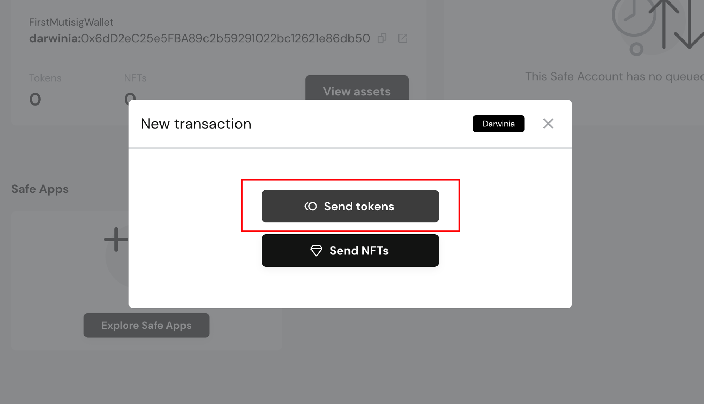
    
3. Enter the correct transfer information.
    
    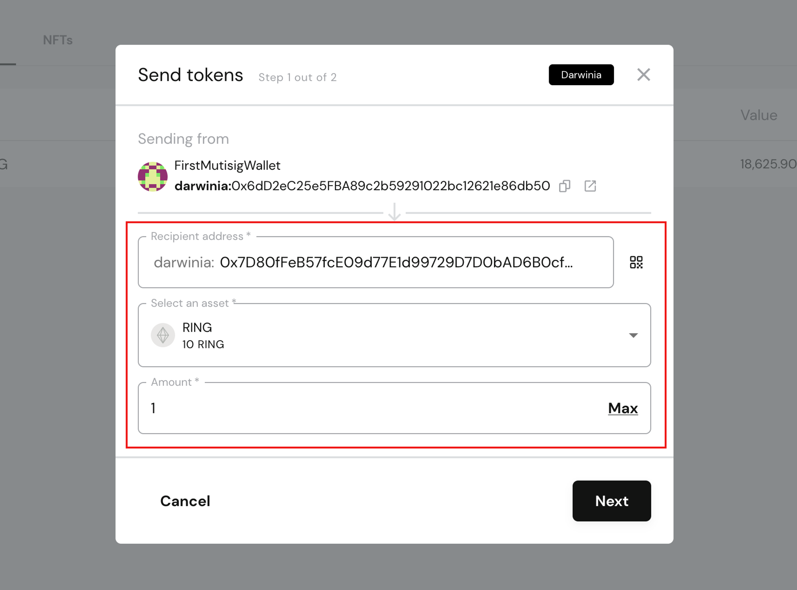
    
    After clicking "Submit," a new transaction is created and proposed on the chain. However, at this stage, the transaction has not been executed yet. Next, other signers need to confirm the transaction.
    
4. Send the transaction link to other wallet signers.
    
    Click on the link inside the red box to copy the transaction link. On this page, you can see "1 out of 2," indicating that one confirmation is still needed.
    
    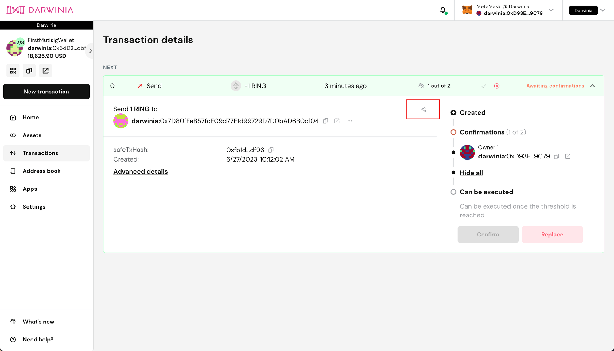
    
5. After receiving the link and opening it, other signers will see the following page. They should click "Confirm”.
    
    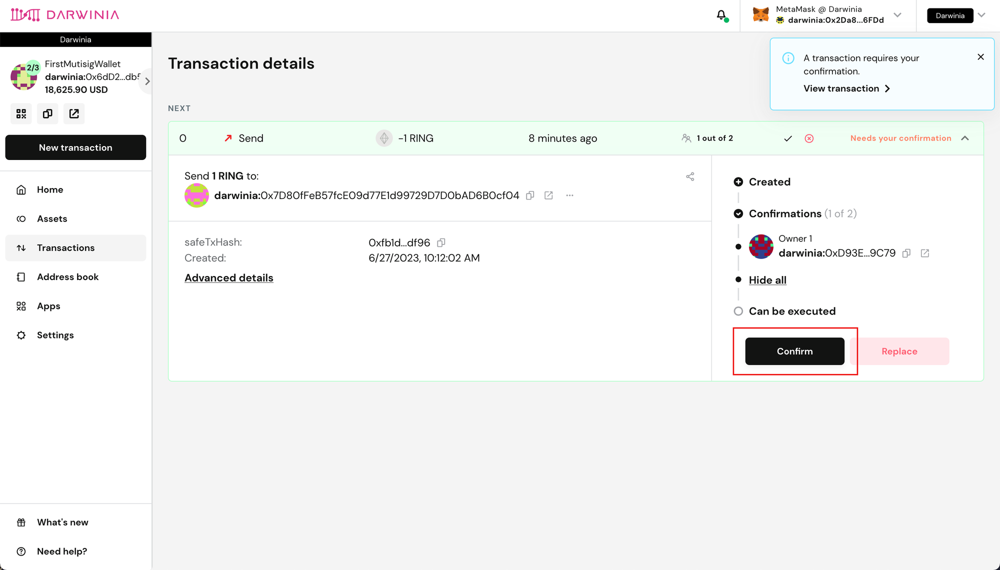
    
6. Because the condition is satisfied when this address confirms, the option "Execute transaction" appears here, indicating that the transaction will be executed immediately after confirmation. If it is not selected, the transaction can be executed by anyone afterwards. The executor is responsible for paying the gas fee.
    
    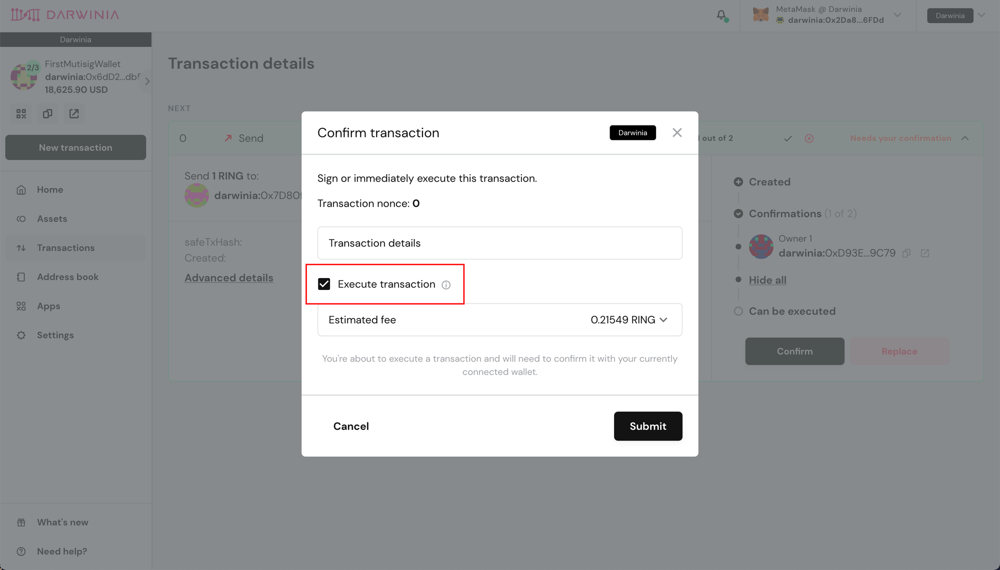
    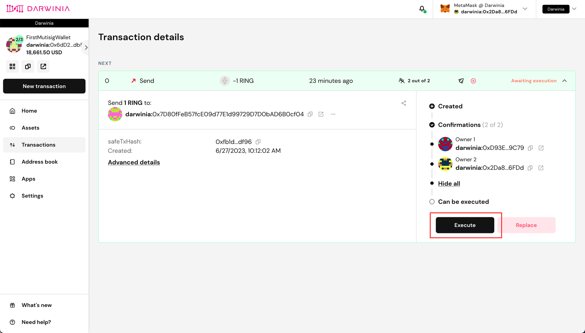