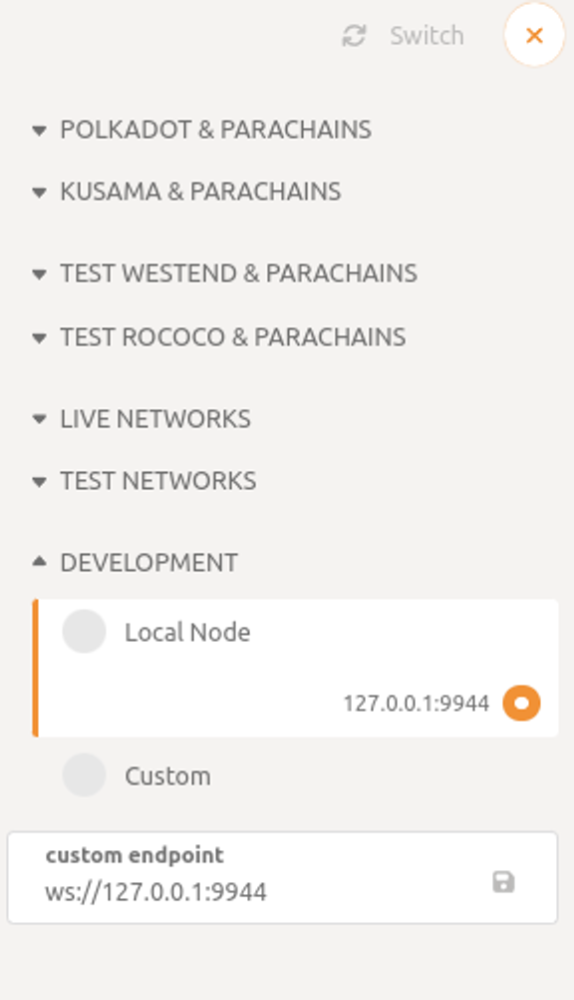
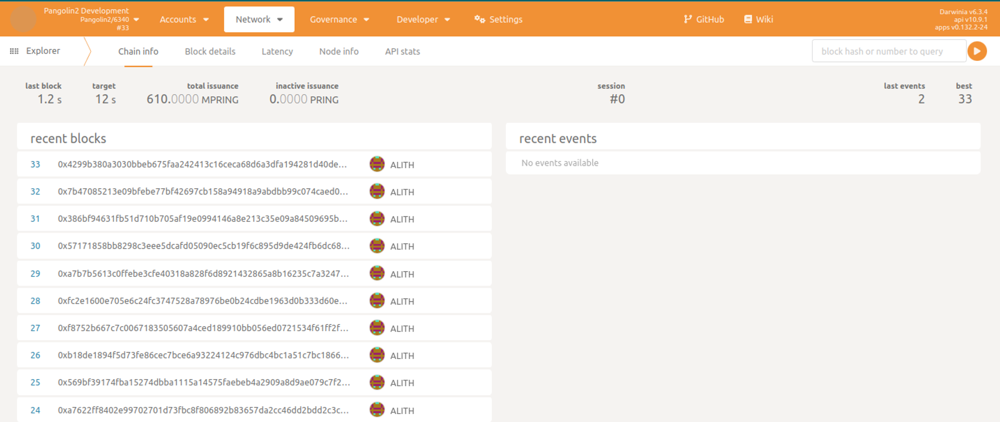

# Run Development Testnet

While there is an established test network, namely the [Pangolin network](./pangolin.md), which serves as an ideal sandbox for your applications, eliminating any concern about initiating and connecting nodes, among other things. The official test network is designed to fulfill application developers' requirements. However, there may be scenarios where you want to perform low-level tasks. In such cases, creating your own development network can significantly enhance your development, testing, or debugging efficiency. This guide will walk you through the process of establishing a single-node development network.

## Compile darwinia node

1. Open a terminal shell on your computer.
2. Clone the darwinia repository by running the following command:
    
    ```bash
    git clone https://github.com/darwinia-network/darwinia.git
    ```
    
3. Change to the root of the repository and compile the node:
    
    ```bash
    cd darwinia
    cargo build --release -p darwinia --features pangolin-native
    ```
    
4. When the compilation is finished, something like this will be printed:
    
    ```bash
    Compiling kusama-runtime v0.9.43 (https://github.com/paritytech/polkadot?branch=release-v0.9.43#ba42b9ce)
    Compiling rococo-runtime v0.9.43 (https://github.com/paritytech/polkadot?branch=release-v0.9.43#ba42b9ce)
    Compiling polkadot-runtime v0.9.43 (https://github.com/paritytech/polkadot?branch=release-v0.9.43#ba42b9ce)
    Compiling darwinia-runtime v6.3.4 (/home/bear/coding/rust-space/darwinia/runtime/darwinia)
    Compiling crab-runtime v6.3.4 (/home/bear/coding/rust-space/darwinia/runtime/crab)
    Compiling pangolin-runtime v6.3.4 (/home/bear/coding/rust-space/darwinia/runtime/pangolin)
    Compiling darwinia v6.3.4 (/home/bear/coding/rust-space/darwinia/node)
    Compiling polkadot-client v0.9.43 (https://github.com/paritytech/polkadot?branch=release-v0.9.43#ba42b9ce)
    Compiling polkadot-service v0.9.43 (https://github.com/paritytech/polkadot?branch=release-v0.9.43#ba42b9ce)
    Compiling polkadot-cli v0.9.43 (https://github.com/paritytech/polkadot?branch=release-v0.9.43#ba42b9ce)
    Compiling cumulus-relay-chain-inprocess-interface v0.1.0 (https://github.com/paritytech/cumulusbranch=polkadot-v9.43#b8999fce)
    Compiling cumulus-client-service v0.1.0 (https://github.com/paritytech/cumulus?branch=polkadot-v0.9.43#b8999fce)
    Finished release [optimized] target(s) in 5m 57s
    ```
    

## Start the development node

After your node compiles, you are ready to start exploring what it does using the darwinia development node.

To start the local Substrate node:

1. In the same terminal where you compiled your node, you can now start the node in development mode by running the following command:
    
    ```bash
    ./target/release/darwinia --chain pangolin-dev --alice --tmp --rpc-external --rpc-cors all
    ```
    
    The darwinia command-line options specify how you want the running node to operate. In this case, the `--dev` option specifies that the node runs in development mode using the predefined `development` chain specification. By default, this option also deletes all active data—such as keys, the blockchain database, and networking information when you stop the node by pressing Control-c. Using the `--dev` option ensures that you have a clean working state any time you stop and restart the node.
    
2. Verify your node is up and running successfully by reviewing the output displayed in the terminal. The terminal should display output similar to this:
    
    ```bash
    2023-07-19 17:28:48 Darwinia    
    2023-07-19 17:28:48 ✌️  version 6.3.4-93d2e8acc04    
    2023-07-19 17:28:48 ❤️  by Darwinia Network <hello@darwinia.network>, 2018-2023    
    2023-07-19 17:28:48 📋 Chain specification: Pangolin2 Development    
    2023-07-19 17:28:48 🏷  Node name: Alice    
    2023-07-19 17:28:48 👤 Role: AUTHORITY    
    2023-07-19 17:28:48 💾 Database: RocksDb at /tmp/substrate2cWt4x/chains/pangolin2-development/db/full    
    2023-07-19 17:28:48 ⛓  Native runtime: Pangolin2-6340 (DarwiniaOfficialRust-0.tx0.au0)    
    2023-07-19 17:28:49 [pallet::staking] assembling new collators for new session 0 at #0    
    2023-07-19 17:28:49 [pallet::staking] assembling new collators for new session 1 at #0    
    2023-07-19 17:28:49 Parachain id: Id(2105)    
    2023-07-19 17:28:49 Parachain Account: 5Ec4AhNxga1JYLioRBNxfRnovheDELVbZTRSnKMgvSVPvNcN    
    2023-07-19 17:28:49 Parachain genesis state: 0x0000000000000000000000000000000000000000000000000000000000000000002c5871dbc5c80fec32f7372f029e271039a29c91b5ad4b0d286277de0daa05b203170a2e7597b7b7e3d84c05391d139a62b157e78786d8c082f29dcf4c11131400    
    2023-07-19 17:28:49 Is collating: yes    
    2023-07-19 17:28:49 [pallet::staking] assembling new collators for new session 0 at #0    
    2023-07-19 17:28:49 [pallet::staking] assembling new collators for new session 1 at #0    
    2023-07-19 17:28:50 🔨 Initializing Genesis block/state (state: 0xb1f3…1cda, header-hash: 0x040e…561a)    
    2023-07-19 17:28:51 🏷  Local node identity is: 12D3KooWPPLzbofiQNjSiW6CmzPmQQkaWGvUuLXjHeDc5BiwgwXE    
    2023-07-19 17:28:51 💻 Operating system: linux    
    2023-07-19 17:28:51 💻 CPU architecture: x86_64    
    2023-07-19 17:28:51 💻 Target environment: gnu    
    2023-07-19 17:28:51 💻 CPU: AMD Ryzen 7 5700G with Radeon Graphics    
    2023-07-19 17:28:51 💻 CPU cores: 8    
    2023-07-19 17:28:51 💻 Memory: 63586MB    
    2023-07-19 17:28:51 💻 Kernel: 5.19.0-46-generic    
    2023-07-19 17:28:51 💻 Linux distribution: Ubuntu 22.04.1 LTS    
    2023-07-19 17:28:51 💻 Virtual machine: no    
    2023-07-19 17:28:51 📦 Highest known block at #0    
    2023-07-19 17:28:51 〽️ Prometheus exporter started at 127.0.0.1:9615    
    2023-07-19 17:28:51 Running JSON-RPC server: addr=127.0.0.1:9944, allowed origins=["http://localhost:*", "http://127.0.0.1:*", "https://localhost:*", "https://127.0.0.1:*", "https://polkadot.js.org"]    
    2023-07-19 17:28:56 💤 Idle (0 peers), best: #0 (0x040e…561a), finalized #0 (0x040e…561a), ⬇ 0 ⬆ 0
    ```
    
    If the number after `finalized` is increasing, your blockchain is producing new blocks and reaching consensus about the state they describe.
    
3. Keep the terminal that displays the node output open to continue.

## Connected to the Polkadot App

Once the node is up and producing new blocks, you can connect to the Polkadot app to explore more advanced features, such as token transfer and more.


