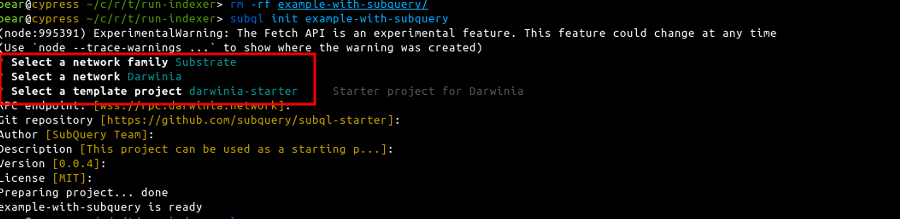
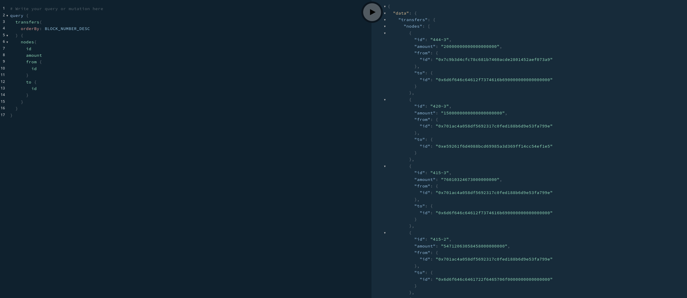

# SubQuery

[SubQuery](https://www.subquery.network/) is a highly regarded blockchain indexing service that is widely utilized within the Polkadot ecosystem. In this guide, we will offer a straightforward approach to indexing the transfer event using the SubQuery tool.

## Prerequisites

### Install Subql

To get started, we need to install the SubQuery tool provided by SubQuery itself. This tool allows us to create new subql project and modify the indexing rules as needed. To install this tool, we can use a package manager like npm or yarn. Let's assume we're using npm for this example:

```bash
npm install -g @subql/cli
```

### Ensure Docker Compose Installed

Before we proceed, please make sure that Docker Compose is installed on your computer. SubQuery utilizes Docker Compose to set up the project environment. If you don't have Docker Compose installed, you can follow [the Docker install documentation](https://docs.docker.com/compose/install/) to install it for your specific operating system.

```bash
docker compose version
```

The output:

```bash
Docker Compose version v2.3.3
```

## Indexing Transfer Event

### Create Workaround

Let's create a new subquery project called `example-with-subquery` to organize and manage the project effectively. This project will serve as a workaround for implementing the indexing functionality.

```bash
subql init example-with-subquery
```

Select the network family as **Substrate** and the network as **Darwinia**, then follow the cli instructions to complete the project creation.

The output:



The `ll example-with-subquery/`is:

```bash
total 1.8M
drwxrwxr-x   3 bear bear 4.0K  9月 21 15:19 dist
drwxrwxr-x   2 bear bear 4.0K  9月 21 15:09 docker
-rw-rw-r--   1 bear bear 1.5K  9月 21 15:29 docker-compose.yml
-rw-rw-r--   1 bear bear 1.1K  9月 21 15:09 LICENSE
drwxr-xr-x 951 bear bear  36K  9月 21 15:17 node_modules
-rw-rw-r--   1 bear bear 1021  9月 21 15:09 package.json
-rw-r--r--   1 root root 1.7M  9月 21 15:17 package-lock.json
-rw-rw-r--   1 bear bear 1.5K  9月 21 15:09 project.yaml
-rw-rw-r--   1 bear bear 5.7K  9月 21 15:09 README.md
-rw-rw-r--   1 bear bear 1.4K  9月 21 15:09 schema.graphql
drwxrwxr-x   5 bear bear 4.0K  9月 21 15:19 src
-rw-rw-r--   1 bear bear  401  9月 21 15:09 tsconfig.json
```

By default, the indexing rule for the balance transfer event is already included in the **`project.yml`** file's handlers section. This means that you don't need to make any changes to the indexing logic if you want to index balance transfer events. However, if you wish to customize the indexing logic for this event, you can do so by writing your own handler in the `**project.yml**` file. This gives you the flexibility to modify the indexing behavior according to your specific requirements. See [SubQuery Academy (Documentation)](https://academy.subquery.network/) for much more technical details.

### Build The Project

Enter the workaround and run the following command:

1. Install necessary packages
    
    ```bash
    cd example-with-subquery && npm install
    ```
    
2. Run Codegen
    
    ```bash
    npm run codegen
    ```
    
    The output:
    
    ```bash
    > example-with-subquery@0.0.4 codegen
    > subql codegen
    
    ===============================
    ---------Subql Codegen---------
    ===============================
    (node:996923) ExperimentalWarning: The Fetch API is an experimental feature. This feature could change at any time
    (Use `node --trace-warnings ...` to show where the warning was created)
    * Schema Transfer generated !
    * Schema Account generated !
    * Models index generated !
    * Types index generated !
    ```
    
3. Build Project
    
    ```bash
    npm run build
    ```
    
    The output:
    
    ```bash
    > example-with-subquery@0.0.4 build
    > subql build
    
    Building and packing code ...
    Done!
    ```
    

### Start Indexing

Let's start up the indexing service by running the command:

```bash
docker compose up -d
```

The output:

```bash
WARN[0000] The "SUB_COMMAND" variable is not set. Defaulting to a blank string. 
[+] Running 3/3
 ✔ Container example-with-subquery-postgres-1        Healthy                                                                                                                                                                                                                                0.0s 
 ✔ Container example-with-subquery-subquery-node-1   Healthy                                                                                                                                                                                                                                0.0s 
 ✔ Container example-with-subquery-graphql-engine-1  Started
```

This indicates that the indexing service has been successfully set up. Then open your browser [http://127.0.0.1:3000](http://127.0.0.1:3000/), paste the following query script into the left-hand pane.

```bash
query {
  transfers(
    orderBy: BLOCK_NUMBER_DESC
  ) {
    nodes{
      id
      amount
      from {
        id
      }
      to {
        id
      }
    }
  }
}
```

The indexing result is displayed in the right pane, as shown below:



### Stop Indexing

To stop the indexing service, type the following command:

```bash
docker compose stop
```

The output:

```bash
WARN[0000] The "SUB_COMMAND" variable is not set. Defaulting to a blank string. 
[+] Stopping 3/3
 ✔ Container example-with-subquery-graphql-engine-1  Stopped                                                                                                                                                                                                                                0.3s 
 ✔ Container example-with-subquery-subquery-node-1   Stopped                                                                                                                                                                                                                                0.5s 
 ✔ Container example-with-subquery-postgres-1        Stopped
```