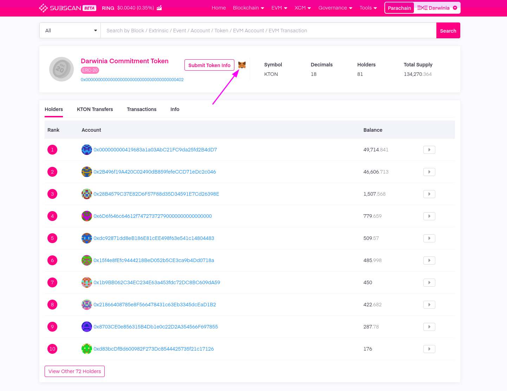

# Commitment Token Precompile

Before delving into the understanding of this precompile, it's essential to have knowledge about the commitment token, within the Darwinia ecosystem. In the architecture of Darwinia, the native token is designed to be fundamentally compatible with Ethereum. This means that the native token can be seamlessly used in Ethereum-compatible environments without requiring extensive modifications or adaptations. It provides out-of-the-box compatibility, allowing users to interact with the native token using Ethereum tools and infrastructure. However, the commitment token in the Darwinia system operates differently. It is a separate standalone token that functions within the Darwinia ecosystem. The commitment token is implemented by a pallet called the [pallet-asset](https://marketplace.substrate.io/pallets/pallet-assets/), which is part of the Substrate ecosystem. The pallet-asset facilitates the management of the commitment token, including features such as token transfers, balances, and other related operations.

Similar to the staking and deposit precompiles, the commitment token also requires a dedicated precompile to enhance its usability for users of Ethereum tools. This precompile acts as a bridge, simplifying the interaction between Ethereum users and the commitment token. By leveraging this precompile, Ethereum users can seamlessly interact with the commitment token using their familiar Ethereum workflows and tools, such as MetaMask.

## Add to MetaMask

View details about the [Commitment Token on Subscan](https://darwinia.subscan.io/erc20_token/0x0000000000000000000000000000000000000402) and add it to MetaMask by clicking its icon.

## Contract Info

- The default contract address:  0x0000000000000000000000000000000000000402
- [The interface](https://github.com/darwinia-network/darwinia/blob/main/precompile/metadata/sol/asset.sol)
- [The ABI](https://github.com/darwinia-network/darwinia/blob/main/precompile/metadata/abi/asset.json)