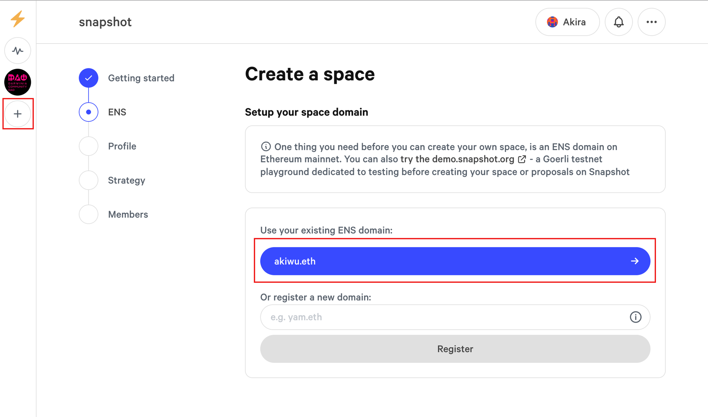
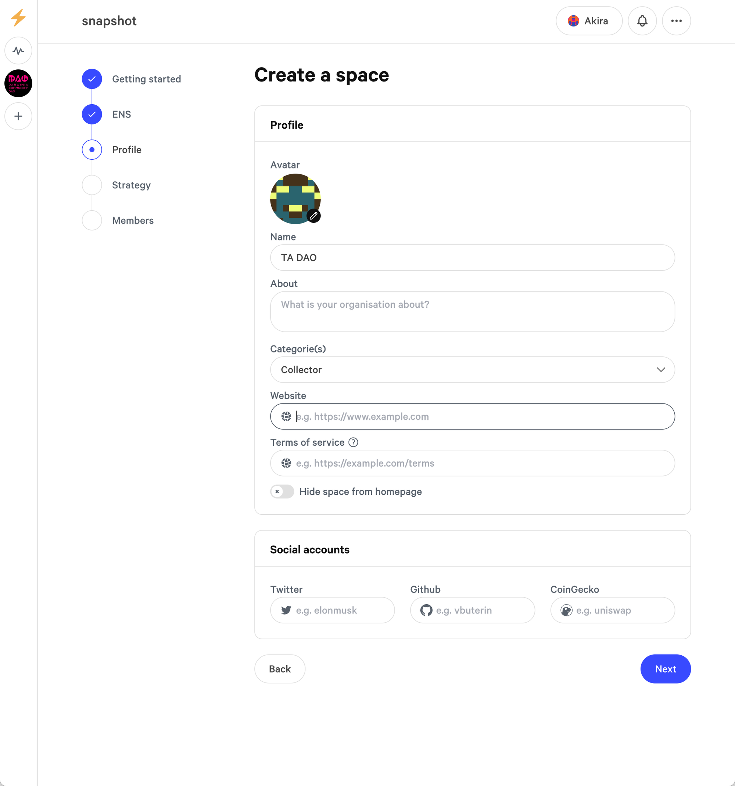
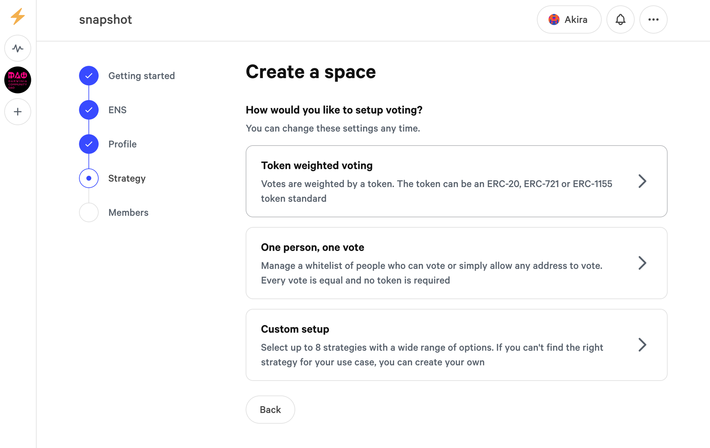
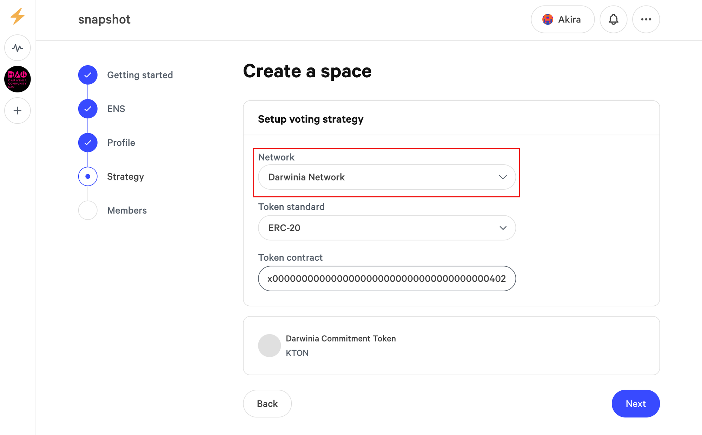
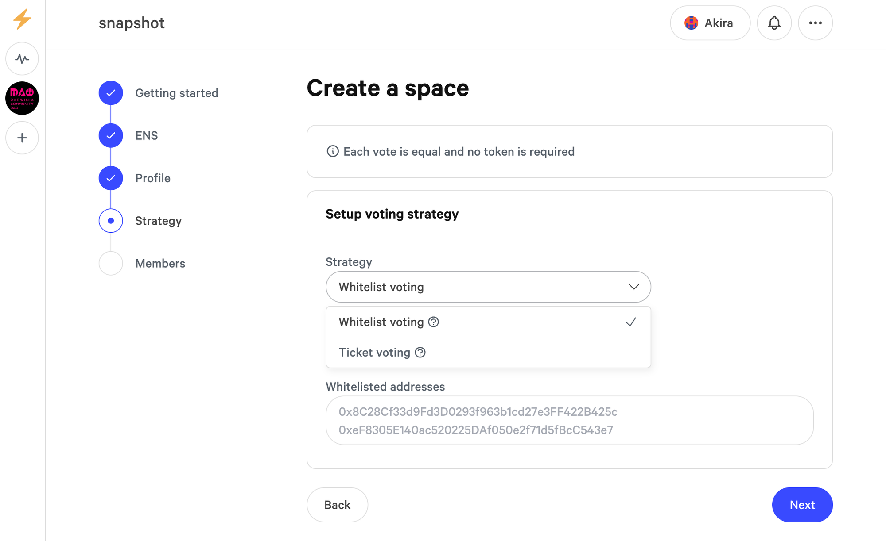
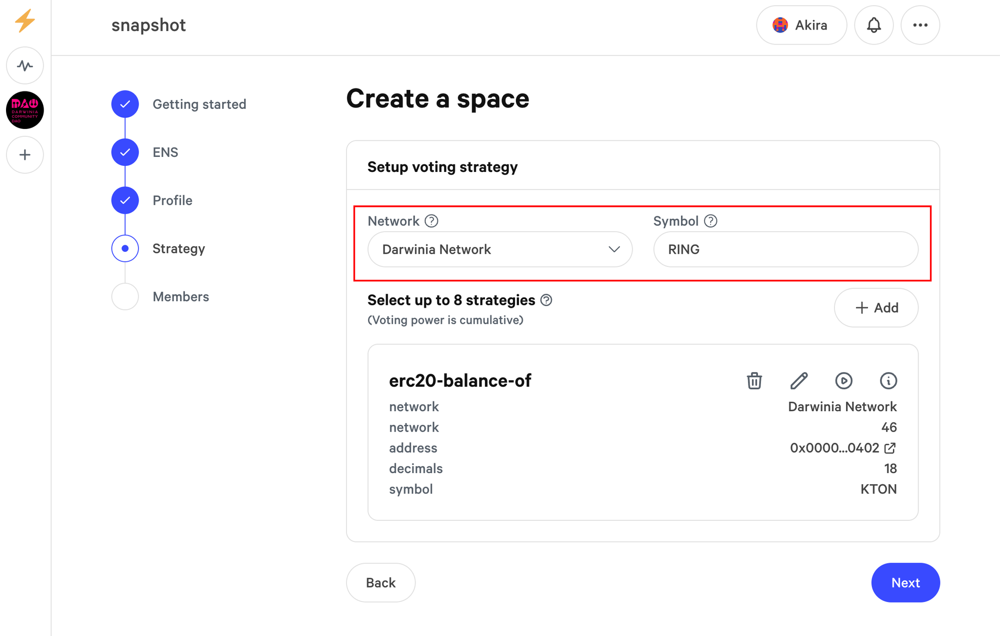
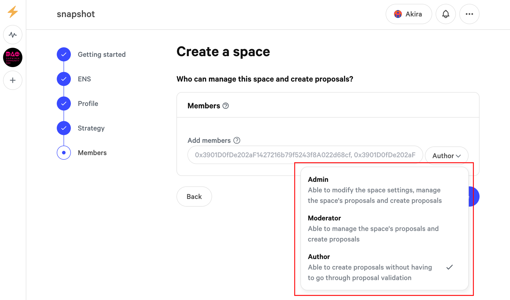

# Create DAO Guide

This guide will show you how to create a DAO on [Snapshot](https://snapshot.org/) for Darwinia Chain. 

Snapshot is a place where projects can create proposals for people to vote on using cryptocurrency. It supports numerous Web3 communities, including these most active DAOs like **[Arbitrum DAO](https://snapshot.org/#/arbitrumfoundation.eth)**. The off-chain nature of Snapshot's voting process enhances accessibility and encourages widespread engagement, allowing participants to contribute their voices to governance decisions without financial barriers.

Snapshot has already support Darwinia Chain. So, we will show steps to build a DAO on Snapshot for Darwinia Chain. 

## Create A Space

For organisations looking to use Snapshot, they need to have an existing profile on the [Ethereum Naming Service,](https://app.ens.domains/) or ENS.  If you **don't own an ENS domain** you will have to register one. 

After your ENS is ready, your ENS name will appear. To confirm it's correct, click on it.

## Create Space Profile

After creating the space, proceed to add or update this information. Click `Next` to continue.

## Select Strategy

Your space can combine up to 8 voting strategies which will be responsible for calculating the users' voting power. The setting affects all proposals that will be created for that space. For the initial setup you have to choose one of the three following strategy types to then specify the strategy details:

### Token weighted voting

The voting power is determined by the amount of tokens held by the user. The token can be of the ERC-20, ERC-721, or ERC-1155 standard. Remember to select "Darwinia Network" for the network.

### One person, one vote

This option can be used in two different ways:

- **Whitelist voting** lets you specify a list of addresses that will be able to vote
- **Ticket voting** will let any wallet vote (option used mostly for testing purposes)

### Custom setup

For more details on setting up your own strategy, please refer to this [resource](https://docs.snapshot.org/user-guides/strategies).

## Add Members

Add your space members, you can select one of the three roles.

Upon clicking the "Create" button, your Snapshot space will be instantly activated, making it accessible to your community members. The URL assigned to your space will serve as its unique address, providing a convenient direct access point. Additionally, community members can search for your space within the Snapshot platform using its name. This Snapshot platform ensures that your community can effortlessly participate in the DAO's governance processes and actively contribute to its collective decision-making.

Learn more from [Snapshot Spaces guides](https://docs.snapshot.org/user-guides/spaces)