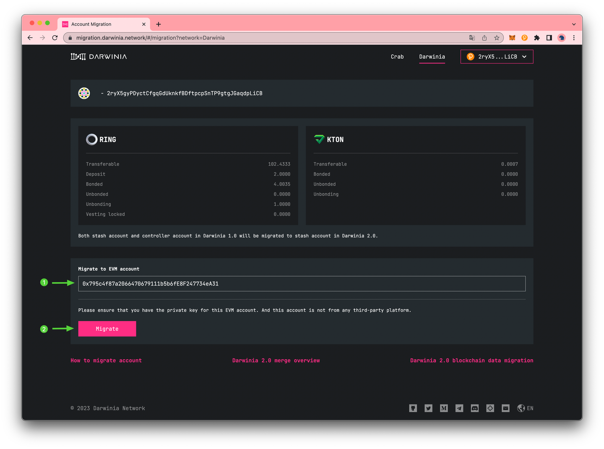
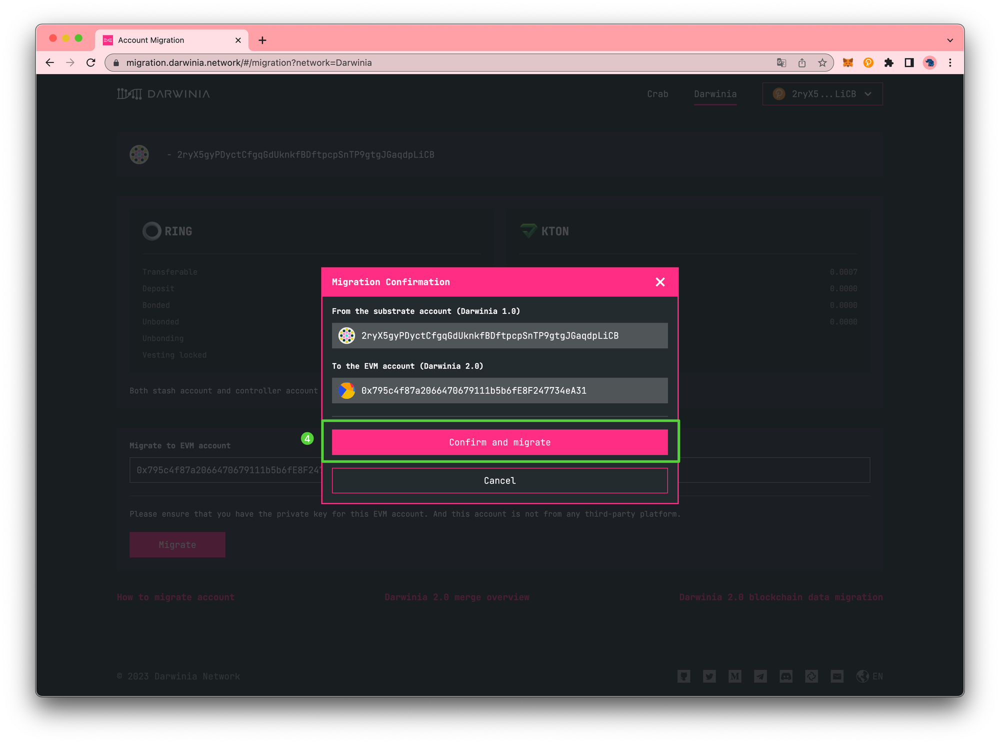

# Migrate Generate Account


!!! info
    This article only covers the migration of general accounts. For guidance on migrating a multisig account, please consult [this tutorial](./multisig-account.md).


This tutorial will walk you through the steps of migrating your accounts from `Darwinia 1.0` to the current Darwinia using the [Account Migration Dapp](https://migration.darwinia.network/#/?network=Darwinia). It's important to note that this tutorial is also applicable for the Crab chain.

## Get Started With The Dashboard

To get started with the dashboard, navigate to [migration.darwinia.network](https://migration.darwinia.network/#/?network=Darwinia). You’ll be prompted to connect to [polkadot{.js} extension](https://polkadot.js.org/extension/), [Talisman wallet](https://www.talisman.xyz/), [Subwallet](https://subwallet.app/), or [NovaWallet](https://novawallet.io/).


Upon accepting the permission, you will be directed to the main dashboard where you will find details about the account data to be migrated. You can click on the top right corner to switch accounts for the corresponding migration operation.


## How to Migrate

For the purpose of account migration operations, we will use the following account as an example: `2ryX5gyPDyctCfgqGdUknkfBDftpcpSnTP9gtgJGaqdpLiCB`

1. Verify that you selected the account you want to migrate from.
2. Enter the EVM account you would like to migrate to.
    
    !!! note
        Please ensure that you **have the private key** for this EVM account. And this account is not from any third-party platform.
    
    !!! note
        Please confirm that the EVM account you are using is a new address that has not been previously used on Darwinia 1.0. If the account already exists on Darwinia 1.0, don't worry 🤗 - the migrate button will not be clickable and you will receive a prompt indicating that `the EVM account is not free` and that you need to fill in another account.
    
    
    
3. Click `Migrate`.





Polkadot{.js} Extension will pop-up and you will be prompted to sign a transaction.

Once the transaction has been confirmed and you receive the transaction confirmed notification, the dashboard will update to include the migration record.


That’s it! Now you’ve successfully migrated the account. Please don’t forget to check your account after the migration is complete. 

## Check Your Account After The Migration

### Transferrable

The current version of [Subscan](https://darwinia.subscan.io/) supports Darwinia data queries except staking.


Also, you can refer to [here](../../../build/getting-started/networks/darwinia.md#network-info) and add the darwinia RPC to your wallet. Then you can see the transferrable `RING` on MetaMask.


How about `KTON`? Please add the `KTON` to MetaMask, then you can see the transferrable `KTON`.

```markdown
Symbol: KTON
Spec: ERC20
Decimals: 18
Smart Contract Address: 0x0000000000000000000000000000000000000402
```


### Bonded & Unbonding & Unbonded & Deposits

Please navigate to [staking.darwinia.network](https://staking.darwinia.network/#/staking?network=Darwinia). You’ll be prompted to connect to [MetaMask](https://metamask.io/).

MetaMask will pop up and ask you to sign in. Once signed in, you will be prompted to select the account to connect to the Dapp and accept permissions.

Upon accepting permissions and changing the network to `Darwinia`, you will be directed to the main dashboard. There, you will find the details of the stake you had on Darwinia 1.0, including Bonded, Unbonding, Unbonded, and Deposits. You can continue to use these to participate in staking on the Darwinia. Please refer to [this tutorial](../staking.md) for instructions on how to stake and earn staking rewards on the Darwinia.

