# Migrate Multisig Account

!!! info
    This article specifically addresses the migration of multisig accounts. If you are looking for information on user interfaces for general accounts or a corresponding migration tutorial, please click [here](https://www.notion.so/Migrate-Generate-Account-66167771afba4768b6878907eb4e86bd?pvs=21).


This tutorial will walk you through the steps of migrating your accounts from `Darwinia 1.0` to the current Darwinia using the [Multisig Account Migration Dapp](https://migration.darwinia.network/#/multisig-home?network=Darwinia). It's important to note that this tutorial is also applicable for the Crab chain.

## Get Started With The Dashboard

To get started with the dashboard, navigate to [migration.darwinia.network.](https://migration.darwinia.network/#/multisig-home?network=Darwinia) You’ll be prompted to connect to [polkadot{.js} extension](https://polkadot.js.org/extension/), [Talisman wallet](https://www.talisman.xyz/), [Subwallet](https://subwallet.app/), or [NovaWallet](https://novawallet.io/).

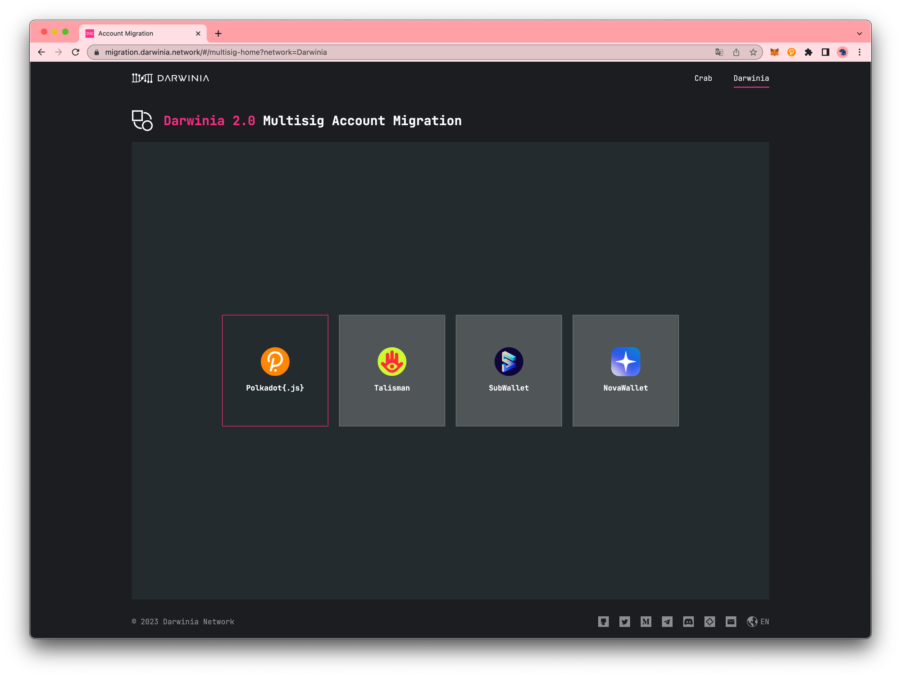

After granting the necessary permissions, you will be redirected to the main dashboard. From there, you need to click on the `Add Multisig` button to include the multisig account that you previously created on `Darwinia 1.0`.

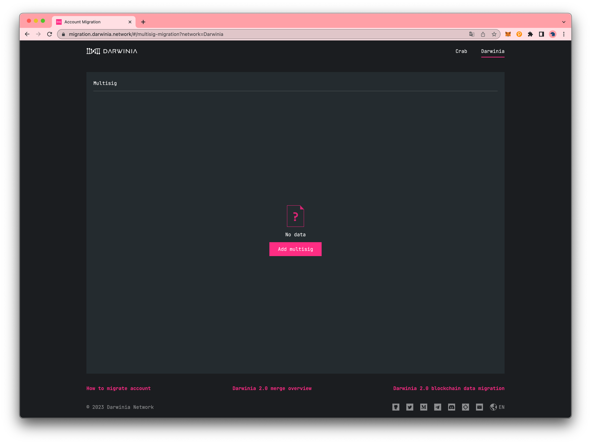
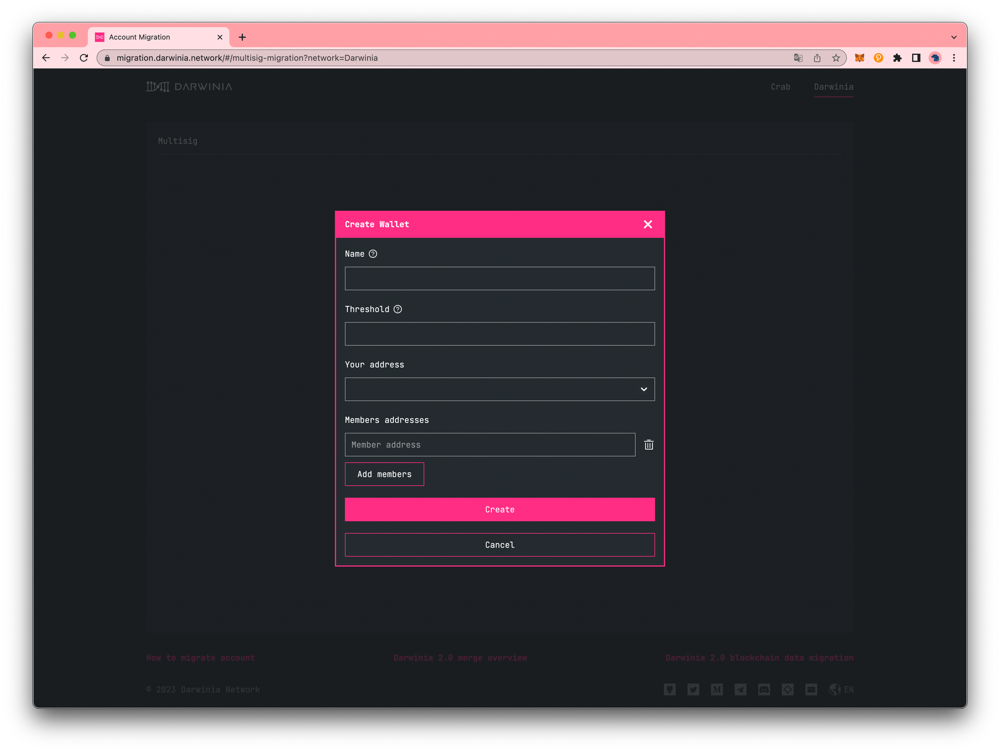

## How to Migrate

!!! note
    Please note that you can use [Gnosis Safe Multisig - IPFS](https://ipfs.io/ipfs/QmfRD4GuqZobNi2NT2C77a3UTQ452ffwstr4fjEJixUgjf/#/wallets) to restore the current Darwinia multisig account that you previously created and perform multisig operations on the current Darwinia.

To illustrate the account migration process, we will use the following multisig account as an example:

```markdown
Threshold: 2
Mulitisig Account: 2psCqUpRFZptgLNiDtUyst9Ves7nWRwL7AzKdKbtYVE3MW5i
Member_1: 2qVLNBzxaEWSRrvC2a7sJ6bCrFi4iRkmtahy81fnnTbwERZC
Member_2: 2t9hijYLPqQgDqmHjvZKBYG6E4AC3W42wo9yTqywvH7MDwq4
Member_3: 2pKL16mgxrA7x8YhXLdJ7T4wKP9gKjxFVv4nQ7ayNVLCFLuR
```

* Please add the multisig account that you wish to migrate from.

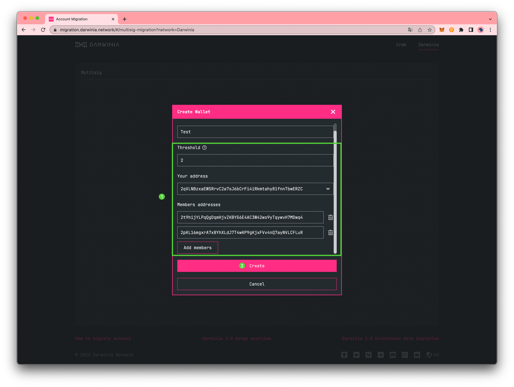
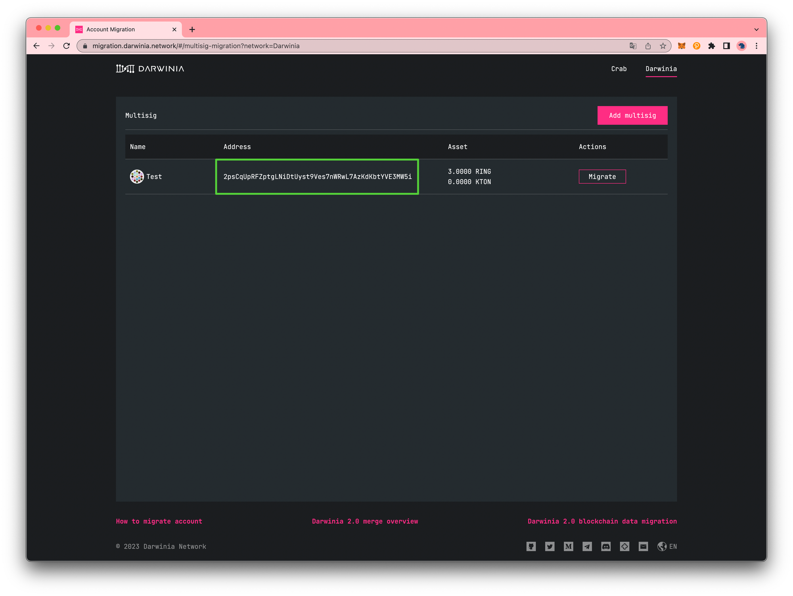

* Step 2: Click on the `Migrate` button. You can also add more multisig accounts for the corresponding migration operation by clicking on the `Add Multisig` button.

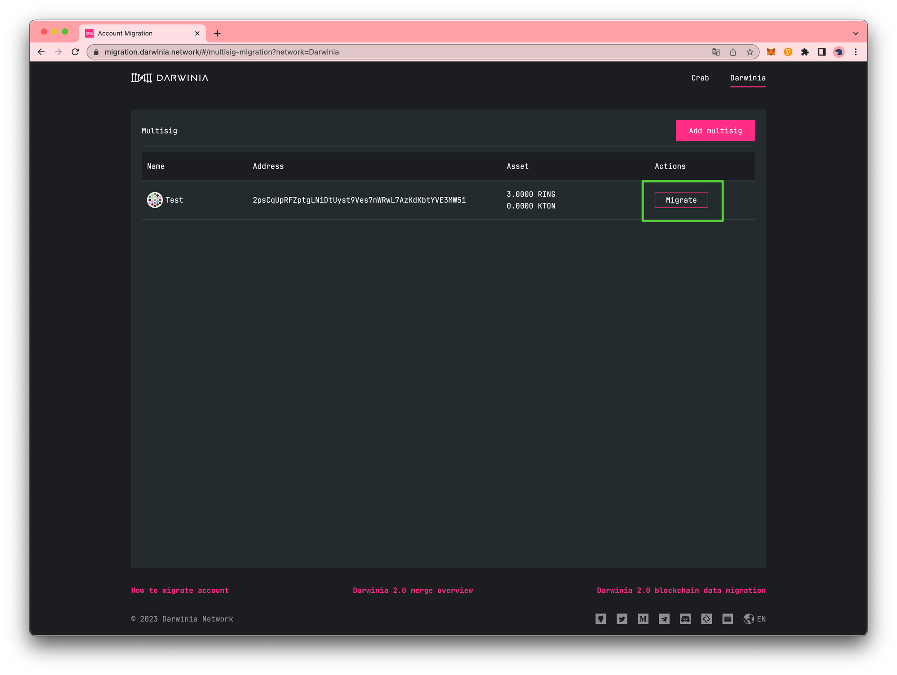

* Please review the details of the multisig account data to be migrated, and once you are satisfied, click on the `Migrate` button to proceed.

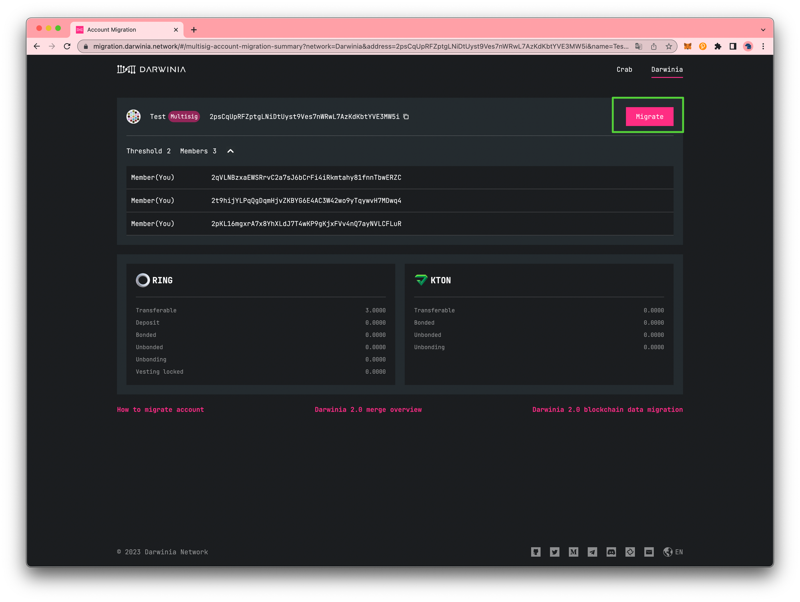

* Please select the destination account type.

* Select the `General account` as the destination for the migration.

> 🙋‍♂️ a. Please ensure that you **have the private key** for this EVM account. And this account is not from any third-party platform.
> 
> b. Please confirm that the EVM account you are using is a new address that has not been previously used on `Darwinia 1.0`. If the account already exists on `Darwinia 1.0`, don't worry 🤗 - the`continue` button will not be clickable and you will receive a prompt indicating that `the EVM account is not free` and that you need to fill in another account.

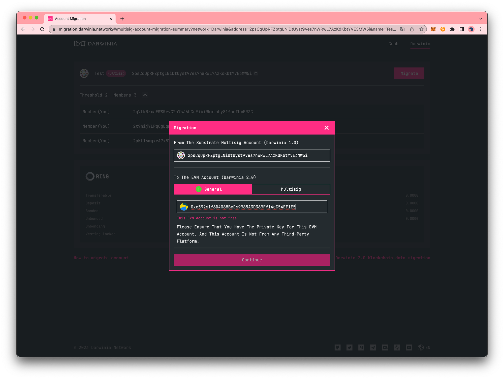

Once you have sent the transaction, simply share the link with the other members of the multisig and wait for their approval to complete the migration process.

* Select the `Multisig account` as the destination for the migration.

You can generate a darwinia multisig account on the page by providing the member addresses and the threshold parameter. For illustrative purposes, we will use the following multisig account as an example:

```markdown
Threshold: 2
Member_1: 0x795c4f87a2066470679111b5b6fE8F247734eA31
Member_2: 0x807b496Bd5fa96dC9E22A43577942b2D90Dd7Ccc
Member_3: 0xe4A9A79d776f375A0de93C7335E8013DBDc4F587
```

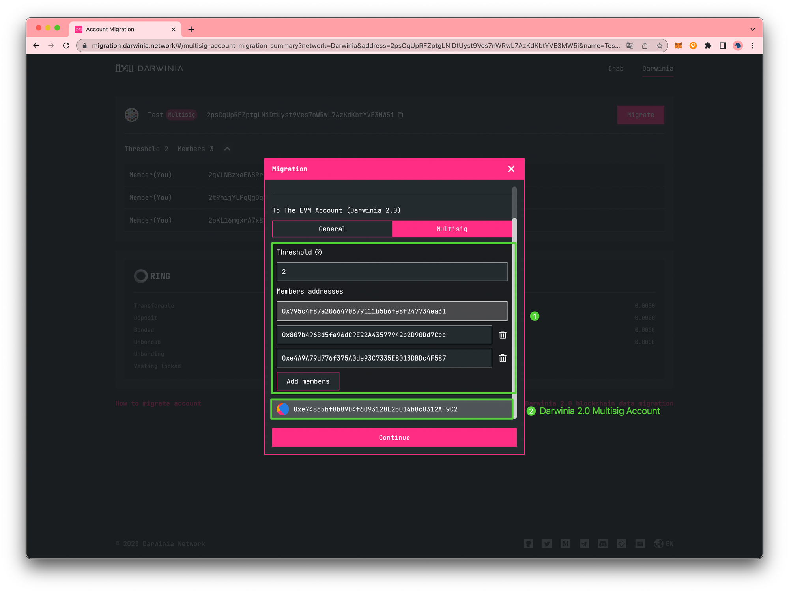

After clicking on the `Continue` button and sending the transaction, please share the link with the other members of the multisig and wait for their approval to complete the migration process. Once the number of approved individuals meets the threshold, you can proceed with the final step of the deployment operation.


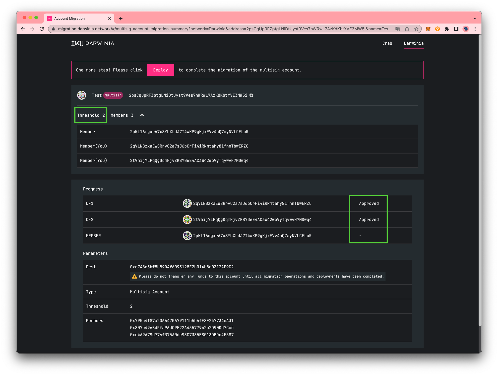

Just one more step! Please click on the `Deploy` button to finalize the migration of the multisig account.

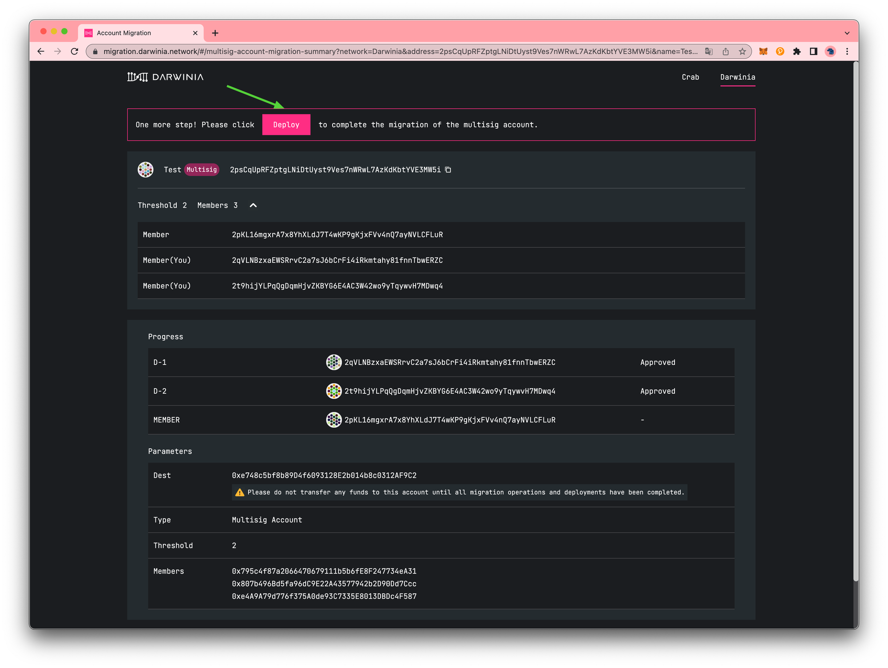
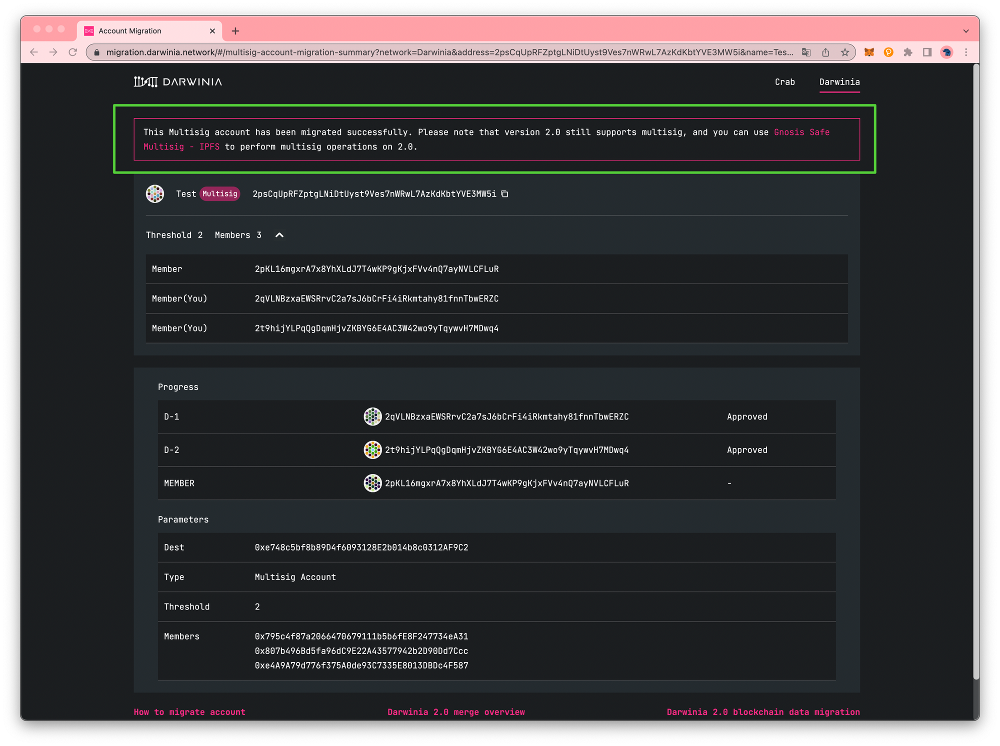