# Transfer Native Token

The first crucial step for a newcomer in the Web3 world is understanding how to operate a cryptocurrency wallet. This is a fundamental skill for interacting with blockchain-based systems, and we have designed a beginner-friendly tutorial to help you navigate this new terrain.

## Transfer Using MetaMask

!!! note
    This tutorial based on the [Koi testnet](../../build/getting-started/networks/koi.md), it operations are also apply to other chains.

- Install the Wallet extension in your browser.
- Import your existing accounts or create new ones. `Test Account 1` and `Test Account 2` are two test accounts in this tutorial.
    
    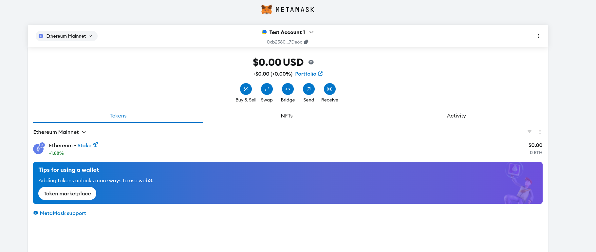
    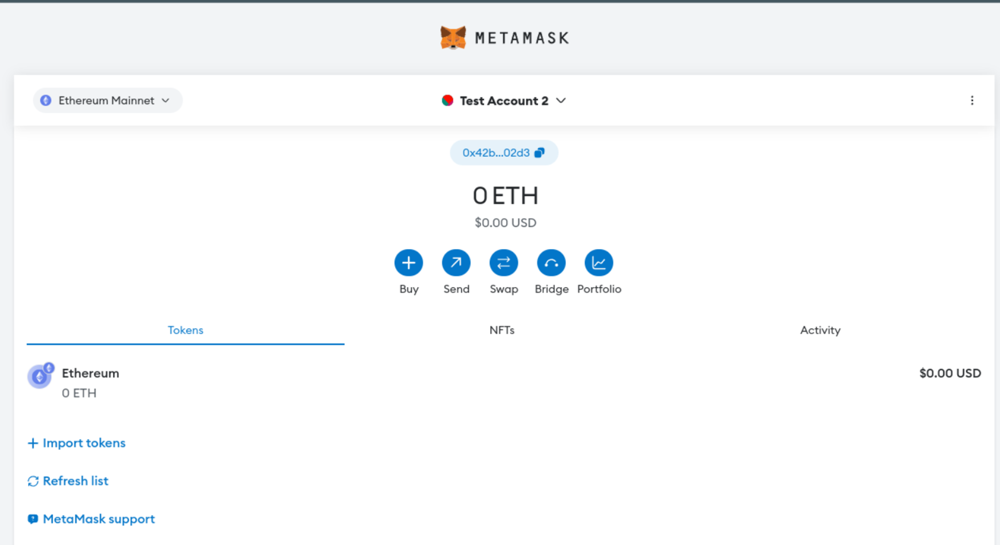

<!-- todo: add the link -->
- At first, you need to switch from the Ethereum Mainnet to the Darwinia networks. For example, take the Koi network as an example, the network information page provides a convenient link to connect directly.

    <!-- todo: update the screenshot     -->
    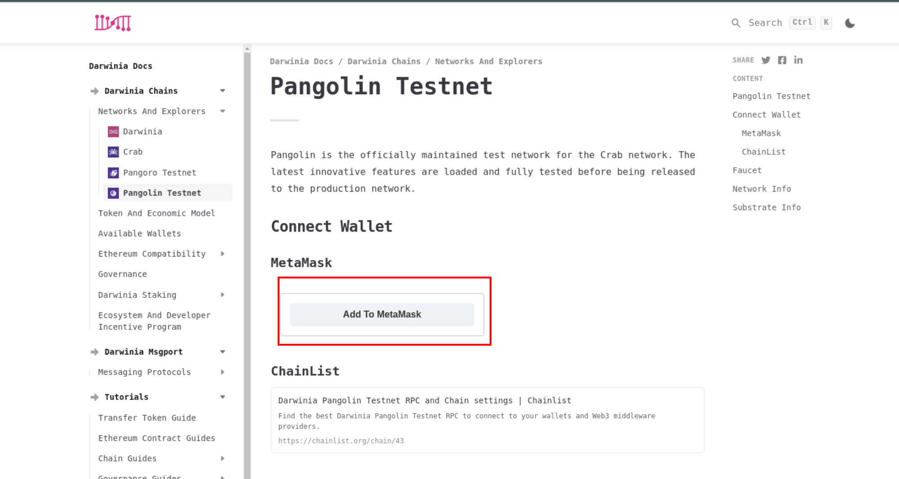
    
    Click the `Add To MetaMask` button.

<!-- todo: update the screenshot -->
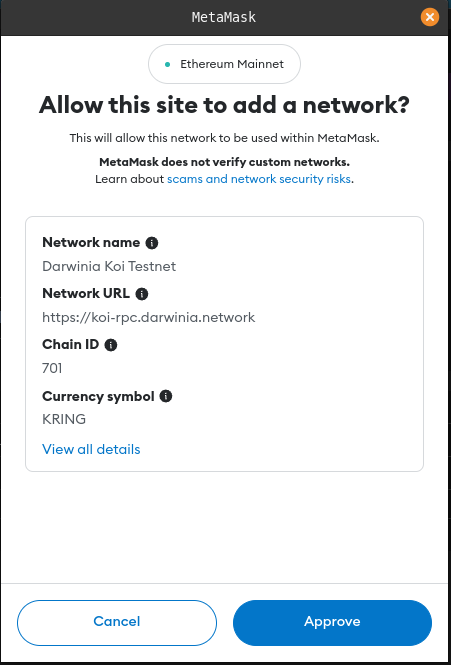

Check the network displayed and click the `Approve` button. Then , you can see that the network has switched from the Ethereum Mainnet to the Koi Testnet.

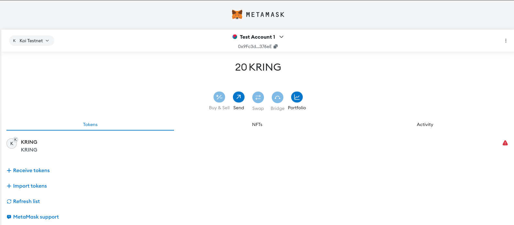
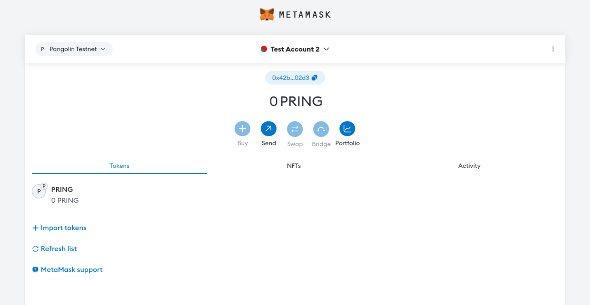

`Test Account 1` has 20 KRING and `Test Account 2` balance is 0. Let's transfer 10 KRING to the `Test Acccount 2` next.

- Transfer
    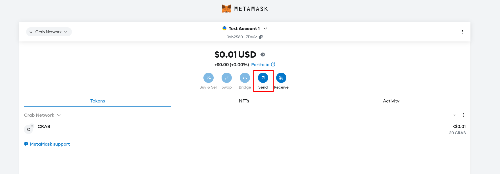
    
    Click `Send` button.

    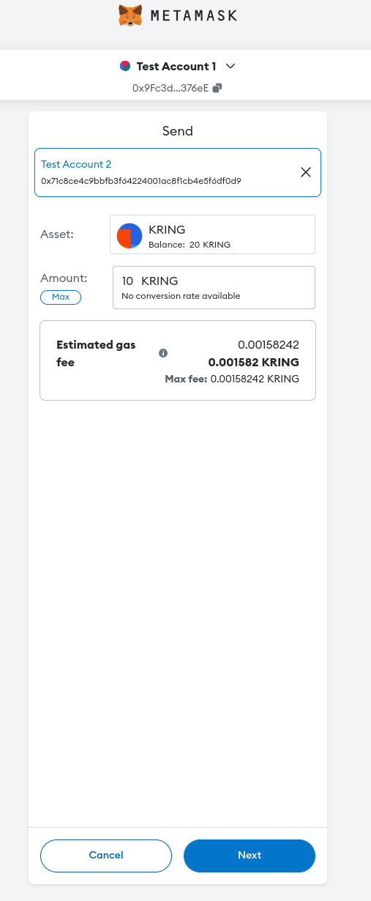
    
    Select the target account and fill in the value amount, click `Next`.
    
    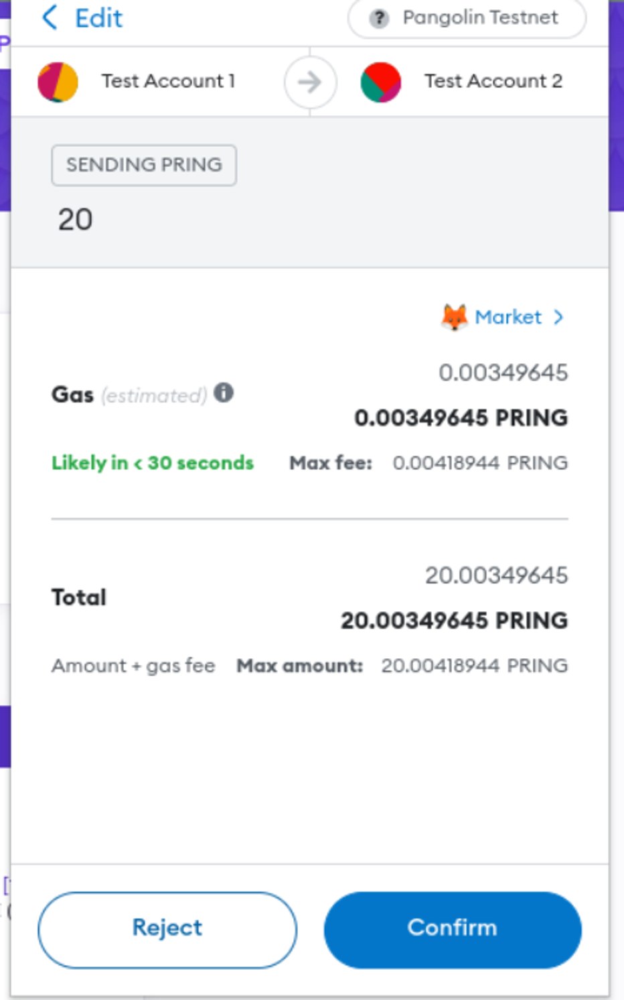
    
    Confirm the source account and target account, then click `Comfirm` button.
    
    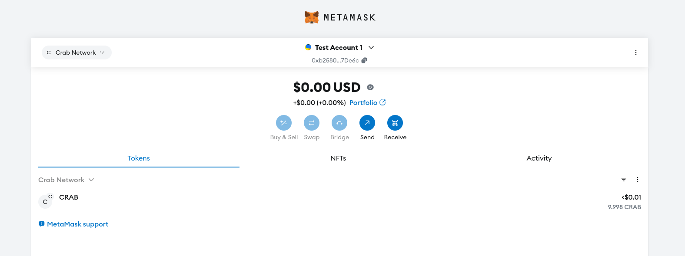
    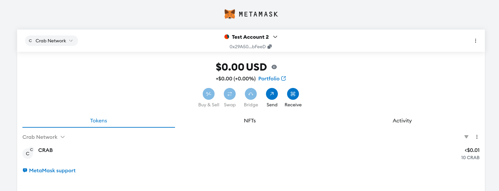/