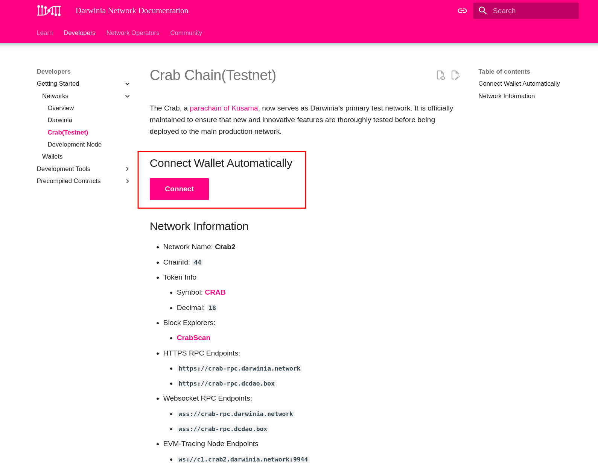
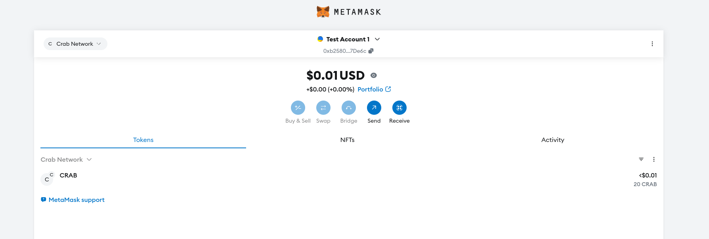
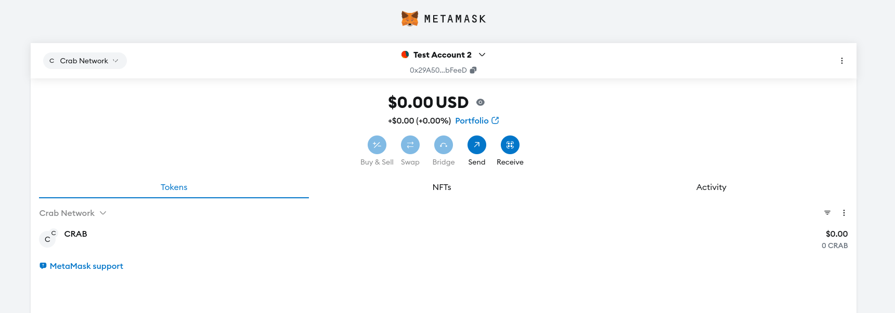
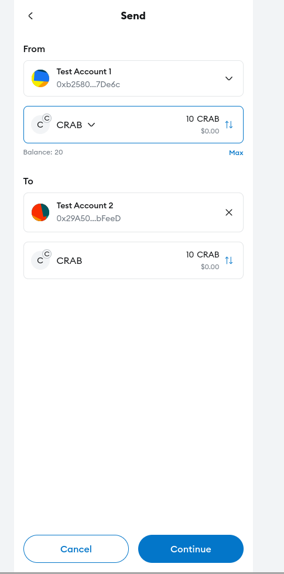
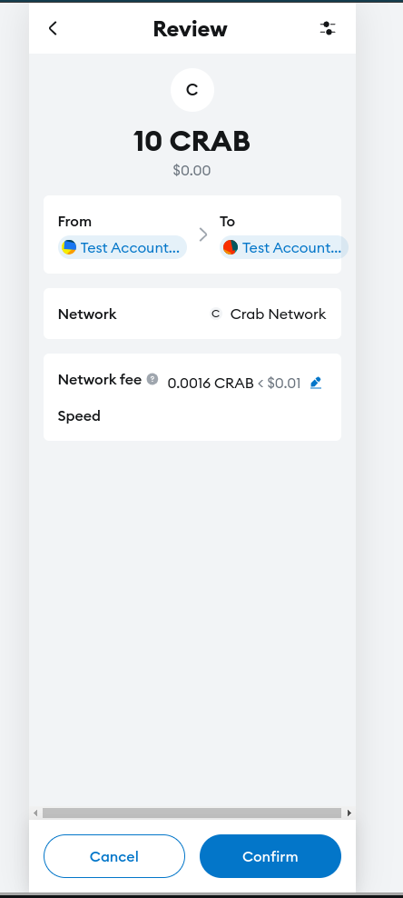

# Transfer Native Token

The first crucial step for a newcomer in the Web3 world is understanding how to operate a cryptocurrency wallet. This is a fundamental skill for interacting with blockchain-based systems, and we have designed a beginner-friendly tutorial to help you navigate this new terrain.

## Transfer Using MetaMask

!!! note
    This tutorial based on the [Crab testnet](../../build/getting-started/networks/crab.md), it operations are also apply to other chains.

- Install the Wallet extension in your browser.
- Import your existing accounts or create new ones. `Test Account 1` and `Test Account 2` are two test accounts in this tutorial.
    
    
    

- By default, the MetaMask extension is connected to the Ethereum Mainnet. So, you need to switch from the Ethereum Mainnet to the Crab network. For example, take the Crab network as an example, [the network information page](../../build/getting-started/networks/crab.md#connect-wallet-automatically) provides a convenient link to connect directly.

    
    
Click the `Connect` button, and the MetaMask extension will automatically switch to the Crab network, check the network displayed and click the `Approve` button. Then , you can see that the network has switched from the Ethereum Mainnet to the Crab testnet.

`Test Account 1` has 20 CRAB and `Test Account 2` balance is 0. Let's transfer 10 CRAB to the `Test Acccount 2` next.

- Transfer
    
    
    Click `Send` button.

    
    
    Select the target account and fill in the value amount, click `Next`.
    
    
    
    Confirm the source account and target account, then click `Comfirm` button.
    
    
    