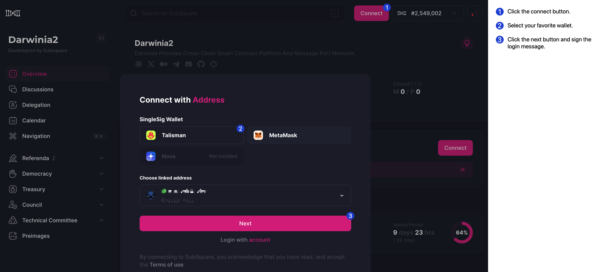

# OpenGov

[OpenGov](https://wiki.polkadot.network/docs/learn-polkadot-opengov-index) represents a governance model that is both decentralized and fair, allowing users to engage directly in decision-making and voting. This model is the most recent addition to the governance approaches within the Polkadot ecosystem. Aimed at facilitating easy participation for the Darwinia community, OpenGov has been integrated into the Darwinia network as of [Release v6.6.0](https://github.com/darwinia-network/darwinia/releases/tag/v6.6.0).

> Matching the importance level of proposals with the required timeline and level of participation is a core change in OpenGov.

Substrate-based blockchains use origins to represent privileges. Different origins have different permissions. Some important operations need to be executed by origins with higher privileges, while less important operations can be executed by origins with lower privileges. The definition of origins in Gov1 is relatively simple. Additionally, when a collective (like a council) agrees on something, they gain a higher level of origin to execute that operation.

In OpenGov, any token holder can submit a proposal, and different origins will be defined based on the importance of the proposal. OpenGov will define different origins for different tasks, with each task including the threshold and voting rate required for a proposal to pass. For example, a runtime upgrade (requiring a `set_code` call, if approved) does not have the same implications for the ecosystem as the approval of a system remark and therefore different origins for these two actions are needed in which different deposits, support, approval, and a minimum [enactment](https://wiki.polkadot.network/docs/learn-polkadot-opengov#enactment) periods will be predetermined on the pallet.

## Referenda

OpenGov defines different referendum tracks determined by origin, which are completely independent of each other.

> 💡 Track: Origin-specific proposal processing pipeline. Tracks are specific to Origin. The number of referendums that can be conducted simultaneously on tracks of different origins is different. Tracks of the Root Origin can only conduct one referendum at a time. Proposals in different tracks can be processed together with proposals in other tracks.

In OpenGov, multiple referendums can take place simultaneously (on different tracks) and anyone can initiate a referendum at any time, and there is no longer a launch period in which a proposal must gain support before entering the public voting stage when submitting a proposal.

Before OpenGov, every referendum proposed was executed by a Root Origin. In OpenGov, proposers choose which origin they wish to use to execute their proposal. Each origin is associated with a type of referendum.

## Lifecycle of a Referendum

from polkadot doc

### Lead-in Period

When the referendum is initially created, the proposal enters the **Lead-in Period**. You can vote at this time.

### Decision Period

When certain conditions are met, the referendum enters the Decision Period. Votes must meet [Approval and Support](https://www.notion.so/Medium-What-is-OpenGov-7303f4524ae54e5589b60f1e2bb58823?pvs=21) criteria for at least the confirmation period; otherwise, the proposal will be automatically rejected. 

Approval refers to the ratio of "approval weight/total vote weight", which measures the proportion of approval among the voted weights. Support refers to the ratio of "number of votes in aye and abstain/total number of votes the system can accommodate", which measures the turnout rate.

### Enactment Period

Approved proposals will enter an enactment period, after which the proposed changes will be executed.

## Differences

The differences between Gov1 and OpenGov are substantial. If you're interested, you can view a comparison table **[here](https://wiki.polkadot.network/docs/learn-polkadot-opengov#gov1-vs-polkadot-opengov)**.

### Cancelling a Referendum

In OpenGov, the act of cancelling a referendum is also a governance operation, and they have their own origin. This 'cancel origin' operates on a faster track. The cancellation track leads to the rejection of the proposal and decides whether the deposit is refunded or burnt.

### Whitelist

Another significant change brought by OpenGov is the whitelist. A whitelisted proposal will be enacted through the Whitelist Caller origin. Those proposals will have a shorter Lead-in, Confirmation, and Enactment period when compared to the Root Origin track.