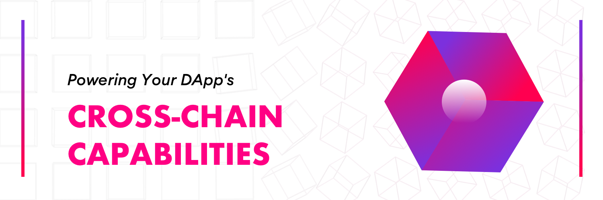

# What is Darwinia?

Darwinia is pioneering the development of cutting-edge cross-chain service solutions, with a strategic emphasis on boosting the cross-chain functionalities of decentralized applications. At its core, [the Darwinia Chains](./build/getting-started/networks/overview.md) represents an EVM-compliant network built upon [the Polkadot framework](https://polkadot.network/). It has been designed to integrate seamlessly with various bridge tools, such as [the Helix Bridge](https://helixbridge.app/) and [the Msgport protocol](https://msgport.ringdao.com/docs/). This integration facilitates the connection between assets within the Polkadot ecosystem and the wider array of EVM chains present in the Ethereum ecosystem.

## Key Features

### Cross-Chain Capabilities

The Darwinia network serves as a bridge between the Polkadot ecosystem and the Ethereum ecosystem, unlocking a wide range of cross-chain capabilities between the two blockchain ecosystems. For example, it enables the connection of Polkadot's AssetHub with a broader array of EVM chains. Moreover, the Darwinia network is poised to be the first place for the development of innovative cross-chain technologies, such as messaging protocols or cross-chain governance.

### EVM Compatibility

The Darwinia network is built to be fully compatible with the Ethereum network, which means it supports the Ethereum Virtual Machine (EVM) and all its associated opcodes. Additionally, the Darwinia network is compatible with the Ethereum JSON-RPC API, which allows developers to interact with the network using the same set of APIs used in the Ethereum network. This compatibility also extends to the gas model, which means the gas costs associated with transactions on the Darwinia network are calculated in the same way as those on the Ethereum network. The result of this compatibility is that applications built on other EVM chains are able to be deployed and used on the Darwinia network without any changes or modifications.

### Security and  Decentralized

The Darwinia network is a parachain of the Polkadot, which means it shares the same level of security as Polkadot. This allows us to focus on providing better cross-chain services to our users, while also ensuring the security of user assets stored in our network.
