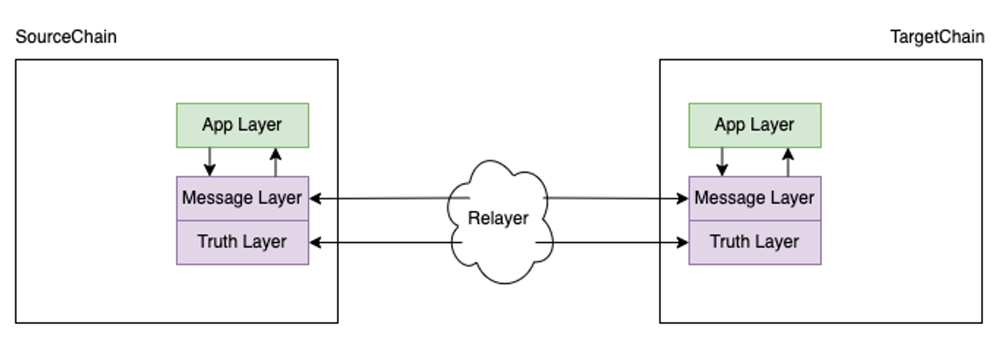
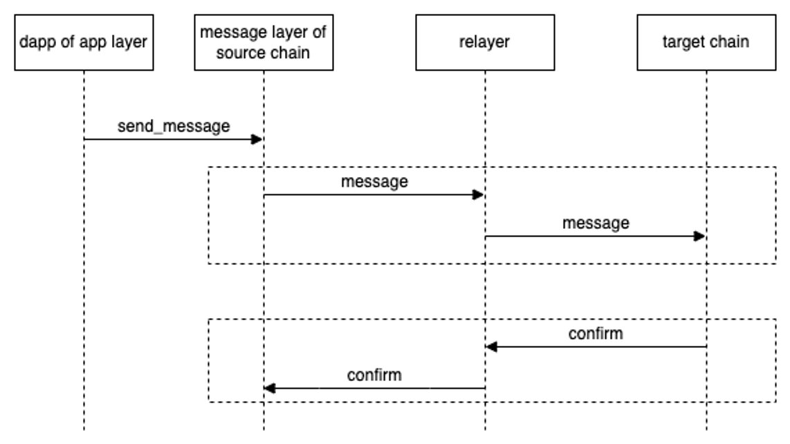

!!! Warning
    LCMP protocol served as a foundational prototype and remains in a testing stage, not yet deployed in a live production environment.


# Overview

LCMP, short for Light Client Cross-Chain Messaging Protocol, is a protocol meticulously designed and developed by the Darwinia core team. It is currently being actively utilized within Darwinia's chains. This protocol enables seamless communication between different blockchains by establishing messaging channels between them.



The LCMP protocol consists of two layers, as shown in the diagram above. The first layer, known as the truth layer, incorporates the light client functionality. This layer is responsible for ensuring the integrity and validity of the cross-chain messages. The protocol derives its name from this layer, which plays a crucial role in maintaining the trustworthiness of the communication. The second layer of the LCMP protocol is the message layer. This layer is specifically designed to handle various aspects related to cross-chain messages. It takes care of issues such as message formatting, transaction fees, and other relevant considerations. By addressing these concerns, the message layer streamlines the process of sending and receiving cross-chain messages, enhancing the overall efficiency and effectiveness of the protocol.

## Message Flow

To facilitate a comprehensive understanding of the message flow, it is important to establish the assumption that the truth layer is functioning as intended. Without a properly functioning truth layer, it becomes impractical to delve into the intricacies of the message layer. This is because the truth layer plays a critical role in providing essential validation services for the message layer. If the truth layer is compromised or broken, it renders the execution of cross-chain messages on the target chain impossible, even if the messages successfully reach their intended destination.



Let's break down and expand upon the steps depicted in the diagram:

1. Dapps in the application layer initiate a cross-chain message transaction by invoking the `send_message(message)` function provided by the Message Layer in the source chain. This function allows Dapps to transmit the desired message across chains, enabling interoperability between different blockchain networks.
2. Upon receiving the cross-chain message transaction, the source chain's message layer performs necessary validations on the message. These validations include checks for staleness or duplication of the message. By conducting these validations, the source chain ensures the integrity and reliability of the cross-chain messaging system. Once the validations are successfully passed, the message is saved in the source chain, making it available for further processing.
3. A crucial role called the "relayer" actively monitors the movement of messages within the source chain. When a new cross-chain message is detected in the source chain, the relayer initiates the process of relaying this message from the source chain to the message layer in the target chain. Acting as a bridge between the two chains, the relayer facilitates the seamless transfer of cross-chain messages, enabling communication and interaction between different blockchain networks.
4. Once the target chain receives the cross-chain message from the relayer, it undergoes a validation process to ensure the authenticity and integrity of the message. It's important to note that some of these validations rely on the truth layer, which helps ensure the accuracy and trustworthiness of the message contents. If the message validations are successfully passed, the cross-chain message information is decoded and subsequently executed in the target chain. At this stage, the message that the Dapp initially sent has been executed in the target chain, regardless of whether it was successful or not.
5. Once the message is executed in the target chain, an event is triggered to inform the relayer. This event serves as a signal for the relayer to confirm the execution result and the latest status back to the source chain. This confirmation process is crucial for the source chain to accurately detect stale or duplicated messages and enables features like message flow control. By confirming the execution result and status, the source chain can maintain an up-to-date view of the cross-chain message's progress and take appropriate actions based on the outcome.
6. Upon receiving the confirm message from the target chain regarding the initial message, the source chain marks the end of the cross-chain message's lifecycle. This signifies the completion of the message's journey across different chains. At a predetermined time, the source chain clears the stored messages, making space for new incoming messages. This process ensures the efficient handling of subsequent cross-chain messages and helps maintain the scalability and performance of the overall system.

## Message Status

- `MessageAccepted` - *Message has been accepted and is waiting to be delivered.*
- `MessagesReceived` - *Messages have been received from the bridged chain.*
- `MessageDispathed` - *Message has been executed in the target chain.*
- `MessageDelivered` - *Messages in the inclusive range have been delivered to the bridged chain.*

## Message Fee

When discussing cross-chain message protocols, an important aspect to consider is the fee associated with these transactions. The fee calculation process is complex, involving various factors such as the tokens used in the source and target chains, the involvement of third-party entities like relayers, and the mechanism for incentivizing and collecting fees. 

Traditionally, fee systems have relied on integrating with an oracle to provide up-to-date token prices from the market. This information is then used within the message protocol to establish fee logic, including conversions based on the oracle's data. However, this approach has inherent flaws, as integrating an oracle introduces additional vulnerabilities and potential attack vectors.

To address these challenges, the Darwinia Core team has designed a sub-protocol called FeeMarket. The FeeMarket protocol aims to tackle the issue of cross-chain fees in a different way. It provides a solution that reduces the reliance on oracles and mitigates the associated risks. The Fee Market is a cross-chain protocol that operates as a market-based system, incentivizing relayers to efficiently deliver cross-chain messages. By implementing a profitability mechanism, the Fee Market encourages active participation from relayers, leading to a more robust and sustainable cross-chain transaction system.

In the context of calculating fees for cross-chain messages, the Fee Market differs from traditional Oracle solutions. Typically, determining the fee involves considering the token value exchange ratio between the source and target chains in real-time, a task often performed by Oracles. However, the Fee Market mechanism eliminates the need for real-time awareness of token value exchange ratios on the blockchain. Instead, it relies on quotes provided by relayers to generate the final fee for cross-chain transactions. This approach allows for flexibility and adaptability, as relayers play a crucial role in determining the fees based on market conditions. The relayer is the third off-chain role of the message carrier, responsible for delivering messages between the source and target chains. Before delivering a message, the relayer calculates its own costs and expected profits by combining the transaction fees of the source and target chains and finally submits its own quote to the fee market. When the fee market has received enough quotes, it selects a suitable quote as the cross-chain fee at that moment according to the pre-defined rules.

## Design Principles

- Users use native tokens of the source chain as the only method of cross-chain payment. We believe this approach provides the best user experience, eliminating the need for users to worry about target chain accounts and fees.”
- The cross-chain fees paid by users are generated by the fee market system and the final price quoted by the fee market is influenced by all relayers involved in the delivery of messages throughout the market.
- The cost on the target chain is at the expense of the relayer who claims the handling fee on the source chain with the proof of delivery after delivery is completed successfully. To incentivize relayers, the fee market system should ensure the relayers gain is greater than the cost in long term. If an automatic pricing mechanism is infeasible, relayers should be able to give their offers manually and shoulder the cost of offering. The relayers should be punished if they fail to relay the message as expected.
- Relayers and Users constitute a secondary supply-and-demand market, where quotes rise when relayers number is low and fall when relayers number is abundant. There are no access restrictions for relayers, and anyone can enter. Relayer should evaluate and quote at their own discretion as an economically rational person. An incomplete list of risks that relayers should take into account is as follows:
    - Fluctuation in token prices and exchange ratios;
    - Time delay between quoting and claiming;
    - Loss of staking funds due to software or network failures;

## Tiered Quotation Mechanism

> 💡 This approach is suitable for scenarios with lower gas fee on the source chain and shorter finality time. It has better versatility, reliability, and robustness. Such networks include Heco, BSC, Polygon and Darwinia.

First, the relayers must register in the fee market system and post their quotes based on the reference price and the expected profit on the blockchain at any time. An off-chain pricing system maintains the reference price. Each relayer should lock a sufficient default margin on the chain to guarantee the faithful execution of the deal.

In this way, a series of quoted prices (price meanings fee per message) come into being in the ascending order on the blockchain. When the user initiates a cross-chain request on the source chain, the lowest n quoted prices are filtered out and the last one is used as the billing price. Those who make these prices are called *Assigned Relayers*. User can send cross-chain messages after paying billing price on the source chain, then wait for message execution on the target chain. The assigned relayers are responsible for ensuring the success of cross-chain message delivery and need to monitor their running relayer clients closely. If a cross-chain message is not executed in the specified time on the target chain, all assigned relayers will be penalised. The reason that we select n relayers as assigned relayers is that we want to have redundancy for executing the message delivery. Note that if the count of relayers in current market are less than n when some users sends cross-chain message, it means the fee market system fails to provide a price for user sending cross-chain message, and the dispatch call user sent on the source chain will simply fail and exit.

In any time, the message delivery and confirmation relayer can be anyone, do not have be the assigned relayer. However, there is an additional bonus for being an assigned relayer as a reward for guarding the cross-chain messaging service. In order to better manage the responsibilities of the n assigned relayers, each assigned relayer is given a time slot (from the creation of the cross-chain message), meaning that the assigned relayer is obliged to deliver the cross-chain message in the allocated time slot. If a message is supposed to be delivered to the target chain in one of the assigned relayer's time slots, but it is not, the assigned relayer is considered to have acted badly and will be penalised for locked assets, or even removed from the set of assigned relayers.

### Reward And Slash Rules

### Key Parameters

When calculating rewards and penalties, the following parameters are crucial.

- `DutyRelayersRewardRatio` - *The reward ratio for the assigned relayer.*
- `MessageRelayersRewardRatio` -  *The reward ratio for the message relayer.*
- `ConfirmRelayersRewardRatio` - *The reward ratio for the comfirm relayer.*
- `AssignedRelayerSlashRatio` - *The slash ratio for the unduty assigned relayer.*
- `Slot` - *A fixed block period time to indicate the message confirmed time.*
- `CollateralPerOrder` - *The collateral that is deposited by the relayer for a transaction.*

### Basic Rules

After a user sends a cross-chain transaction, the fee market system calculates the penalty or reward according to the time the cross-chain transaction is confirmed, with the following rules:

- The cross-chain transaction is confirmed before the last block of the n slot.
    
    As long as the order is confirmed before the last block of the nth slot, we consider it to be delivered on time, and the calculation of rewards and penalties varies depending on when the message is confirmed.
    
    Suppose the cross-chain message has n slots, the message is confirmed at the m-th slot, and `Pm` denotes the quote price of m-th slot. At this point, the assigned relayers from 0 to m slots will be penalized, and the penalty will be calculated as `AssignedRelayerSlashRatio * CollateralPerOrder`, while the assigned relayers from m to n slots will receive a reward for ensuring the message is completed on time `(DutyRelayersRewardRatio * (fee - Pm)) / (n - m)`. `Pm` plus the penalties for the other assigned relayers mentioned above will be distributed as new rewards to the message delivery relayer and the message confirm relayer, where the message delivery relayer receive the `MessageRelayersRewardRatio` of this reward, the message confirm relayer gets the `ConfirmRelayersRewardRatio` of this reward. The rest of the fee will be given to treasury.
    
- The cross-chain transaction is confirmed after the last block of the n slot.
    
    We believe that this cross-chain transaction is severely delayed, in which case all assigned relayers will be heavily penalized by deducting the `AssignedRelayerSlashRatio` of the `CollateralPerOrder` and calculating an additional penalty amount based on the delay time. These penalty amounts, plus the cross-chain fees paid by users, will be distributed as new rewards to the message delivery relayer and the message confirm relayer, where the message delivery relayer receive the `MessageRelayersRewardRatio` of this reward, the message confirm relayer gets the `ConfirmRelayersRewardRatio` of this reward.
    

The following diagram shows how rewards are distributed:

```bash
                          assigned offensive relayers collateral
                                        |                                        |---> messaage delivery relayer
                                        |                                        |
            |- slot price + slot offensive slash(may have) = message reward -->  |
            |                                                                    |
message fee -                                                                    |---> message confirm relayer 
            |                   ---> treasury
            |                   |
            |- message surplus -|
                                |
                                ---> slot duty rewards -> assigned duty relayers
```

### An example

1. Assume that relayers `R1`, `R2`, `R3`, `R4` and `R5` have registered with the fee market and are all running relayer clients capable of delivering messages with quote prices of `P1=10`, `P2=20`, `P3=30`, `P4=40` and `P5=50` and are registered with a locked asset of `300`.
2. Assume that the total number of assigned relayers specified by the fee market system is `3` (default). In this case, the fee market will generate a cross-chain fee of `30` (10 < 20 < 30 < 40 < 50) and the set of assigned relayers is `R1, R2, R3`.
3. Assume that the slot value is equal to `50` blocks and `CollateralPerOrder` is equal to `100` in the fee market runtime.

In this case, suppose the source chain receives a cross-chain message at height `100` and the user pays a cross-chain fee of `30`. After the source chain receives the message, the fee market assigns `R1, R2 and R3` as the assigned relayers for the message, respectively, and their corresponding time slots are `(100, 150)`, `(150, 200)`, `(200, 250)`

After that, all relayers clients will observe the message in the source chain and deliver it to the target chain first.

The slash, reward analysis is divided into two cases.

- *the message in time (confirmed before the end of the 3rd assigned relayer's slot)*
    - Confirmed at block `110(the first slot)`
        
        No assigned relayers will be slashed in this case.
        
        Reward Summary:
        
        - To assigned relayers (R1, R2, R3): `(DutyRelayersRewardRatio * (30 - 10)) / 3 = 1`
        - To treasury: `30 - 10 - 1 * 3 = 17`
        - To message delivery relayer: `10 * MessageRelayersRewardRatio = 8`
        - To message confirm relayer: `10 * ConfirmRelayersRewardRatio = 2`
    - Confirmed at block `160(the second slot)`
        
        Since the message is confirmed at the second slot, the first assigned relayer will be slashed.
        
        Slash Summary:
        
        - R1: `100 * AssignedRelayerSlashRatio = 20`
        
        Reward Summary:
        
        - To assigned relayers (R2, R3) = `(DutyRelayersRewardRatio * (30 - 20)) / 2 = 1`
        - To treasury: `30 - 20 - 1 * 2 = 8`
        - To message delivery relayer: `(20 + 20) * MessageRelayersRewardRatio = 32`
        - To message confirm relayer: `(20 + 20) * MessageRelayersRewardRatio = 8`
    - Confirmed at block `210(the third slot)`
        
        Since the message is confirmed at the third slot, the first two assigned relayer will be slashed.
        
        Slash Summary:
        
        - R1: `100 * AssignedRelayerSlashRatio = 20`
        - R2: `100 * AssignedRelayerSlashRatio = 20`
        
        Reward Summary:
        
        - To assigned relayers (R3) = `(DutyRelayersRewardRatio * (30 - 30)) / 1 = 0`
        - To treasury: `30 - 30 - 0 = 0`
        - To message delivery relayer: `(10 + 20 * 2) * MessageRelayersRewardRatio = 56`
        - To message confirm relayer: `(10 + 20 * 2) * MessageRelayersRewardRatio = 14`
- *the message times out (confirmed after the end of the 3rd assigned relayer's slot)*
    - Confirmed at block `260(Out of slot)`
        
        The message is confirmed out of slot 10 blocks, all the assigned relayer will be slashed.
        
        Slash Summary:
        
        - R1: `100 * AssignedRelayerSlashRatio + 10 * 2 = 40`
        - R2: `100 * AssignedRelayerSlashRatio + 10 * 2 = 40`
        - R3: `100 * AssignedRelayerSlashRatio + 10 * 2 = 40`
        
        Reward Summary:
        
        - To assigned relayers: `0`
        - To treasury: `0`
        - To message delivery relayer: `(30 + 40 * 3) * MessageRelayersRewardRatio = 120`
        - To message confirm relayer: `(30 + 40 * 3) * MessageRelayersRewardRatio = 30`

## Implementations

Here are the two implementations of the LCMP that we discussed:

- [Solidity LCMP](https://github.com/darwinia-network/darwinia-messages-sol)
    
    This implementation achieves the truth and message layer using smart contracts written in Solidity. It provides cross-chain capabilities for chains that are Ethereum Virtual Machine (EVM) compatible. By leveraging the power of smart contracts, the Solidity LCMP enables secure and reliable cross-chain communication between different EVM-compatible chains.
    
- [Substrate LCMP](https://github.com/darwinia-network/darwinia-messages-substrate)
    
    This implementation achieves the truth and message layer using a substrate pallet written in Rust. It provides interaction capabilities for parachains and solo chains within the Polkadot system. It allows chains to send and receive messages, exchange data, and perform operations across the Polkadot ecosystem.
    

These two implementations cater to different blockchain ecosystems and provide cross-chain capabilities tailored to their specific requirements. The Solidity version focuses on EVM-compatible chains, while the Substrate version targets the Polkadot system, enabling interaction between various chains in that network.
