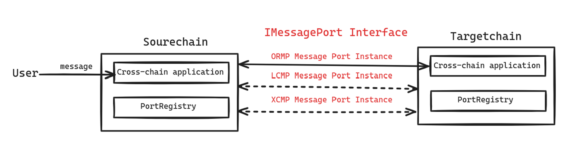

# Overview

In the evolving landscape of blockchain technology, the need for interoperability and seamless communication between diverse blockchains has never been more critical. Msgport, a groundbreaking initiative by Darwinia, stands at the forefront of this challenge, offering a robust solution for cross-chain messaging. With a focus on facilitating effortless asset and information transfer across blockchains, Msgport is revolutionizing the way applications communicate in web 3.0.

## Core Components and Innovations
The Darwinia Msgport encompasses a collection of smart contracts that outline standardized interfaces for facilitating a cross-chain messaging protocol. 

At the heart of this system is the core interface, [IMessagePort](../msgport/interfaces.md#imessageport), which is designed with flexibility to support various implementations. 

Highlighting Msgport's versatility are its flagship integrations:

  - [ORMP](../msgport/messaging-protocols/ormp.md): Oracle Relayer Messaging Protocol leverages chain-independent components, such as oracles and DApp-preferred relayers, to verify cross-chain messages. This approach integrates diverse verification mechanisms, ensuring robust and flexible cross-chain communication.
  - [LCMP](../msgport/messaging-protocols/lcmp.md): Light Client Cross-Chain Messaging Protocol employs blockchain consensus mechanisms and light clients as decentralized verifiers. This ensures the integrity and accuracy of message verification across different blockchains, fostering a secure and trustless environment for message passing.
  - [XCMP](../msgport/messaging-protocols/xcmp.md): Developed by Polkadot, Cross-Consensus Message Passing facilitates seamless messaging between various parachains within the Polkadot network. Messages are exchanged directly by parachains, relayed and verified by the relay chain, exemplifying efficient inter-parachain communication and interoperability.

These implementations underscore Msgport's commitment to fostering interoperability, ensuring that assets and information can navigate the complex landscape of blockchain technology smoothly.

## Integration and Understanding
For developers and applications eager to leverage the power of Msgport, the journey begins with the [Msgport Workflow Documentation](../msgport/workflow.md) and a series of comprehensive [Tutorials](../msgport/tutorial/remix-demo.md). These resources are meticulously crafted to demystify the complexities of Msgport, offering a clear path to integration. From foundational knowledge to step-by-step guides, developers can expect a seamless onboarding experience, enabling them to harness the full potential of cross-chain messaging.

## Embracing the Future

As the digital world continues to evolve, Msgport stands as a beacon of innovation, guiding the way towards a more interconnected and efficient blockchain ecosystem. Whether you are looking to bridge assets or enhance the capabilities of your blockchain application, Msgport offers the tools and support needed to transcend traditional boundaries and embrace the future of cross-chain communication.
