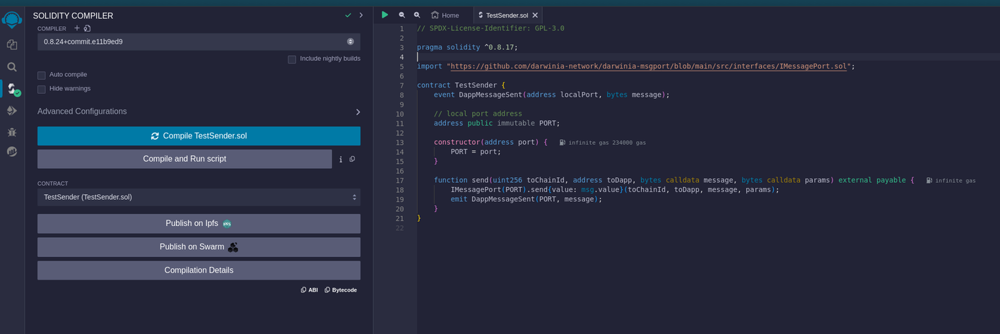
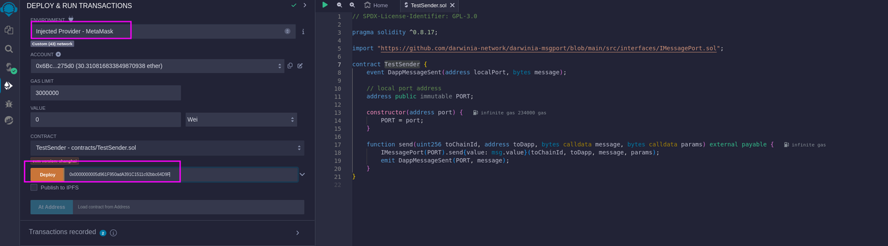
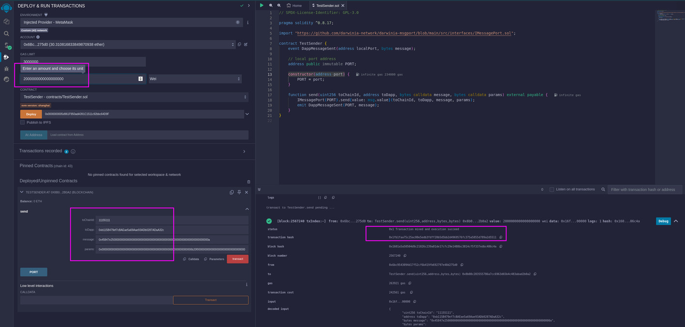
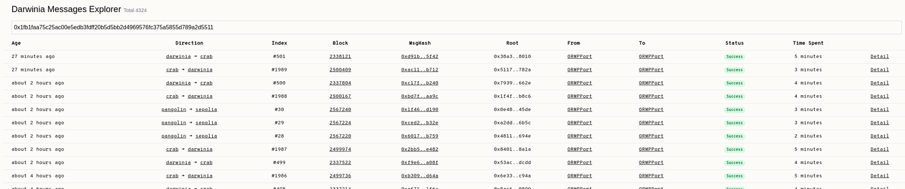

# Pangolin > Sepolia Remix Demo

In this guide, we'll walk you through the process of **sending cross-chain messages from the Darwinia Pangolin testnet to the Ethereum Sepolia testnet** using the Darwinia msgport protocol with Remix. No extensive smart contract development expertise is necessary — as long as you're familiar with deploying and interacting with Solidity smart contracts in Remix, you'll be able to follow along. Let's dive in!

## Prerequisites

### Get Pangolin Test Token

Before we proceed, it's important to understand that in our cross-chain communication, the Pangolin network serves as the source chain while the Sepolia network acts as the destination chain. It's crucial to have this distinction in mind. According to the msgport design, the fee for sending a cross-chain message is paid using the source chain's native token, which in this case is the Pangolin testnet token. Therefore, you'll need to acquire some test tokens beforehand. To do so, please use [the provided faucet](https://www.notion.so/Pangolin-Chain-1e9ac8b09e874e8abd6a7f18c096ca6a?pvs=21) and ensure you add the Pangolin network to your Ethereum wallet, such as MetaMask.

### The TestReceiver Contract

For ease of understanding, we'll be working with an existing contract on the Sepolia network named **`TestReceive`**. You can find the contract details at [Sepolia Etherscan](https://sepolia.etherscan.io/address/0xb115b479ef7cbaeae5a69aae93adb0287adaa32c#code). The contract has a straightforward design; it includes a variable named **`sum`** and offers a method to increment its value.

```solidity linenums="1" title="TestReceiver.sol"

pragma solidity ^0.8.17;

import "lib/darwinia-msgport/src/user/Application.sol";

contract TestReceiver is Application {
    event DappMessageRecv(uint256 fromChainId, address fromDapp, address localPort, uint256 num);

    // local port address
    address public immutable PORT;

    uint256 public sum;

    constructor(address port) {
        PORT = port;
    }

    /// @notice You could check the fromDapp address or messagePort address.
    function addReceiveNum(uint256 num) external {
        uint256 fromChainId = _fromChainId();
        address fromDapp = _xmsgSender();
        address localPort = _msgPort();
        require(localPort == PORT);
        sum += num;
        emit DappMessageRecv(fromChainId, fromDapp, localPort, num);
    }
}
```

The contract at address **`0xb115B479ef7cBAEae5a69Aae93ADb0287ADaA32c`** will serve as the destination in this tutorial. We will demonstrate how to increase the **`sum`** variable by calling the **`addReceiveNum(uint256 num)`** function through a cross-chain message from the Pangolin network in the upcoming steps.

## Send Message From Pangolin

### Prepare The TestSender Contract

Create a new Solidity file named **`TestSender.sol`** and copy the contract code provided into it. Ensure that it compiles successfully without any errors.

```solidity linenums="1" title="TestSender.sol"
// SPDX-License-Identifier: GPL-3.0

pragma solidity ^0.8.17;

import "https://github.com/darwinia-network/darwinia-msgport/blob/main/src/interfaces/IMessagePort.sol";

contract TestSender {
    event DappMessageSent(address localPort, bytes message);

    // local port address
    address public immutable PORT;

    constructor(address port) {
        PORT = port;
    }

    function send(uint256 toChainId, address toDapp, bytes calldata message, bytes calldata params) external payable {
        IMessagePort(PORT).send{value: msg.value}(toChainId, toDapp, message, params);
        emit DappMessageSent(PORT, message);
    }
}

```



### Deploy The TestSender

After successfully compiling **`TestSender.sol`**, the next step is to deploy it on the Pangolin testnet. Switch your wallet to the Pangolin network, if you need information on how to do this, consult the [network details](../../evm/chains/pangolin.md#network-info). The contract requires a parameter for the constructor **`address port`**, which is the address of the ORMP port, a constant across all networks. Enter **`0x0000000005d961F950adA391C1511c92bbc64D9F`** as the parameter and click the deploy button to deploy the contract on the Pangolin testnet. To monitor the transaction status, you may also visit the [Pangolin Subscan](https://pangolin.subscan.io/).




### Send Message



The most thrilling part of the process is invoking the **`send(uint256 toChainId, address toDapp, bytes calldata message, bytes calldata params)`** method on the TestSender contract, which will initiate the cross-chain message transmission. The parameters for this call are somewhat complex, so let's break them down for clarity:

1. value: `2000000000000000000`
    - The cross-chain message fee. For the purpose of this demonstration, we'll employ a hardcoded cross-chain message fee that exceeds the normal rate to ensure reliability. In practical scenarios, the fee should be determined by the [msgport API](https://www.notion.so/Msgport-API-a702936b4a8047bcb4f6bf95154b8809?pvs=21).
2. toChainId: **`11155111`**
    - The Sepolia chain ID.
3. toDapp: **`0xb115B479ef7cBAEae5a69Aae93ADb0287ADaA32c`**, 
    - The address of the existing TestReceiver contract on Sepolia.
4. message: **`0x45847e25000000000000000000000000000000000000000000000000000000000000000a`**
    - This is the encoded function call for **`addReceiveNum(uint256)`**. For example, if you want to add the number 10, the encoded message is .
5. params:`0x000000000000000000000000000000000000000000000000000000000000b20f000000000000000000000000000000000000000000000000000000000000000000000000000000000000000000000000000000000000000000000000000000600000000000000000000000000000000000000000000000000000000000000000`
    - This is the specific encoding required by the [msgport API](https://www.notion.so/Msgport-API-a702936b4a8047bcb4f6bf95154b8809?pvs=21) for additional message parameters. The example provided is the result you would obtain from the API for the given inputs.

After setting up the required parameters, proceed to click the transact button to execute the **`send`** method, which will send the cross-chain message to Sepolia. Remember to note down the transaction hash `0x1fb1faa75c25ac00e5edb3fdff20b5d5bb2d4969576fc375a5855d789a2d5511` that appears in the Remix debug panel. We'll use this hash to track the status of the cross-chain operation in the following step.

## Check Message Status

A [msgport scan](https://www.notion.so/Msgport-Scan-20e10e1727de4b07baaee0c7e1e3f627?pvs=21) available to monitor the status of cross-chain messages, offering the ability to index messages by either the transaction hash or the msghash. Typically, querying with the transaction hash is the most convenient approach.




## Check In The TestReceiver

When the message status indicator turns green and shows **success**, it signifies that the cross-chain message process has been completed. At this point, you can verify the **`TestReceive`** contract to confirm that the **`sum`** value has incremented, or you can examine the [contract's events](https://sepolia.etherscan.io/address/0xb115b479ef7cbaeae5a69aae93adb0287adaa32c#events) for confirmation.